# Geoclick — User manual

This manual explains Geoclick to someone who wants to understand it without
installing or running it. Every screen is shown with a screenshot, and every
button, label and message is explained: what it looks like, what it does, and
what the player sees in return. Geoclick is made by Diego Amicabile.

It describes **Geoclick v0.18.0** (4 October 2026).

The screenshots come from the web version, on a laptop-sized window and on a
phone-sized screen, and are made by a script (`npm run manual-shots`) that is
rerun at every release. The Windows and Android apps show exactly the same
screens (see [Getting Geoclick](#2-getting-geoclick)); the two pictures of the
app windows in that section are older. The progress shown in the screenshots
(how much of each map is known, favourites and so on) is made-up example data.

## Contents

1. [What Geoclick is](#1-what-geoclick-is)
2. [Getting Geoclick](#2-getting-geoclick)
3. [How the screens fit together](#3-how-the-screens-fit-together)
4. [The start screen](#4-the-start-screen)
5. [Map screens: what they have in common](#5-map-screens-what-they-have-in-common)
6. [Known: the map you build](#6-known-the-map-you-build)
7. [Overview: see every name](#7-overview-see-every-name)
8. [Quiz: drag the names onto the map](#8-quiz-drag-the-names-onto-the-map)
9. [What counts as known](#9-what-counts-as-known)
10. [Tour: a guided flight over the map](#10-tour-a-guided-flight-over-the-map)
11. [Towns maps](#11-towns-maps)
12. [Facts and name origins](#12-facts-and-name-origins)
13. [Terrain](#13-terrain)
14. [My maps: favourites and recent](#14-my-maps-favourites-and-recent)
15. [The tutorial](#15-the-tutorial)
16. [Languages](#16-languages)
17. [On a phone](#17-on-a-phone)
18. [The Windows and Android apps](#18-the-windows-and-android-apps)
19. [Your data and privacy](#19-your-data-and-privacy)
20. [The maps](#20-the-maps)
21. [Questions and answers](#21-questions-and-answers)
22. [Glossary](#22-glossary)

---

## 1. What Geoclick is

Geoclick is a game for learning geography: where a country's regions, states
or provinces are, where its main towns and cities are, and where the countries
and capitals of a continent are.

- **156 maps across 53 countries and the six continents.** Most countries have
  two maps: its regions (called states, provinces, prefectures or districts,
  depending on the country) and its larger towns. Some also have finer, more
  detailed maps. See [The maps](#20-the-maps).
- **Four ways to use each map:**
  - **Known:** the map you build. Names you have placed right in the quiz are
    written on it as strongly as you know them, and you can tap any place to
    add its name and read a fact about it;
  - **Overview:** the whole map with the names written on it, to look at and
    learn from, as many as fit without overlapping, the rest a zoom away;
  - **Quiz:** the game itself. Drag each name from a tray onto the map;
  - **Tour:** the map flies from place to place on its own, showing each name
    in turn.
- **It remembers what you know.** Place a name right three times in a row with
  no mistake and it counts as known; one mistake and that name starts again.
  The better you know a map, the fewer names its quiz offers at a time.
- **Every place has something to say.** A name's origin, where it is, what is
  special about it: see [Facts and name origins](#12-facts-and-name-origins).
- **Three languages:** English, German and Italian, for the buttons and for
  the facts.
- **No account, no sign-up.** Everything is kept on the device you play on.
- **Three ways to play:** in a web browser, as a Windows app, or as an Android
  app. All three are the same game.
- **A built-in tutorial** walks a new player through it in about three minutes.

## 2. Getting Geoclick

- **In a web browser:** open https://geoclick.netlify.app/. Nothing to
  install; it works in any recent browser, on a computer or a phone.
- **Windows and Android apps:** download them from the public releases page,
  https://github.com/diegoami/geoclick-releases/releases/latest. The web
  version's About page links there too ("Download for Windows or Android").
  - **Windows:** run the `-setup.exe` file (or the `.msi`). Windows SmartScreen
    warns about an "unknown publisher", because the installer isn't
    code-signed; choose *More info*, then *Run anyway*.
  - **Android:** open the `.apk` file on the phone and allow Android to install
    apps from unknown sources when it asks. Geoclick isn't in the Play Store.
- **Previews:** the releases page sometimes also has *alpha* or *beta* versions,
  marked as pre-releases. They're test builds of the next version; the one
  marked *Latest* is the normal one.
- **Source code:** https://github.com/diegoami/Geoclick2027.

The Windows app is a window showing the same screens as the website:

The Android app fills the phone screen, under the phone's own status bar:

## 3. How the screens fit together

- The **start screen** is where you choose a map: a world map and a list.
- Choosing a map opens it on **Known**.
- On every map screen, a row of buttons at the top (the *map bar*) switches
  between **Known**, **Overview**, **Quiz** and **Tour** for that map, or goes
  back to the start screen (**Maps**).
- **My maps** (your favourites and recent maps), **About** and the **user
  manual** open from the start screen's toolbar.
- The **tutorial** can be started from the start screen or from any map screen,
  and it takes you through the main screens in turn.

Every screen has a web address of its own, for example `/map/italy-regions/quiz`
for the Italy — Regions quiz, so a screen can be bookmarked or shared as a link.

## 4. The start screen

This is the first screen. It opens on a map of the world, with the continents
named on it, and a panel of maps beside it.

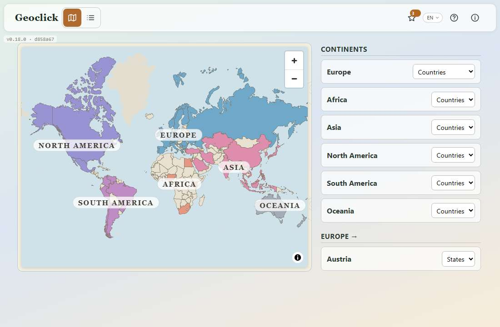

**The toolbar** is one bar of icons. Each icon's name shows when you hover it,
and a screen reader reads it:

- **Geoclick**, the name, on the left (hidden on a narrow phone);
- **Map / List**, two icons side by side: the world map with its panel, or the
  list of every map. Your choice is kept;
- **★ My maps**: your favourites and recent maps, on a page of their own, with
  a number on the star saying how many there are (see
  [My maps](#14-my-maps-favourites-and-recent));
- **EN**: the language (see [Languages](#16-languages));
- **?**: starts the [tutorial](#15-the-tutorial);
- **ⓘ About**: what Geoclick is, the version, the credits, the link to this
  manual, and in the web version the link to download the apps;
- **Exit**: closes the app, in the Windows and Android apps only.

**The version badge**, in small grey type at the top left, shows the version
number and a short build code, for example `v0.18.0 · d858a67`. It is useful
when reporting a problem.

### Choosing a map on the world map

- Tap a **continent**, or the sea near it, to enter it: the panel then lists
  that continent's countries. Tap the sea nearest the continent you are in to
  open its **Countries** map.
- Tap a **country's name** on the map to open its main map straight away, on
  Known. A country with no map of its own tells you so.
- In the panel, every row has a **map-type menu** on its right (Countries,
  Capitals, Regions, Towns…). Choosing a type opens that map at once; tapping
  the country's name opens the one the menu shows. The menu remembers the last
  type you chose for each country.

Standard maps come first in a country's menu, whole nations before their
parts. The finer ones are listed below a line, after the standard ones (see
[Detailed maps](#detailed-maps)).

### The list

The **List** view is the same rows without the map, in alphabetical groups, with
a search box above them:

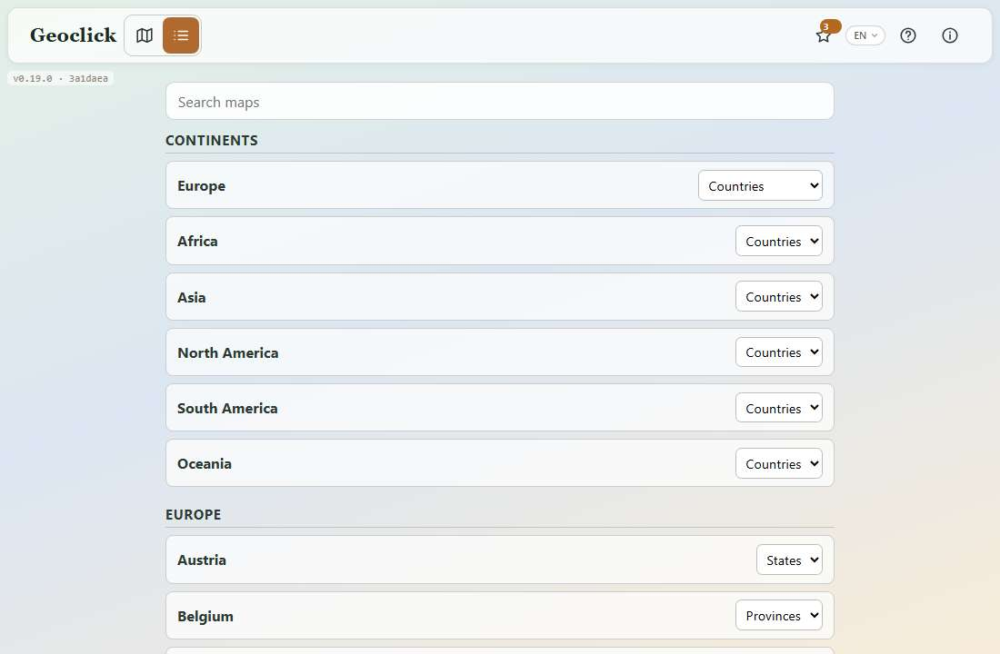

### Finding one map among many

Type a few letters in the **search box** and the list narrows to what
matches, with a count underneath:

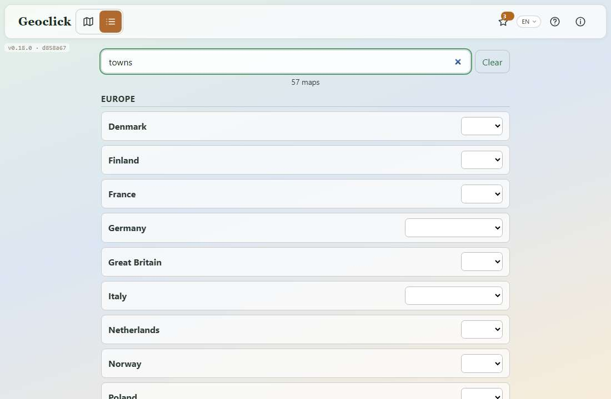

- It matches the **country** ("korea" finds South Korea) and the **kind of
  map** ("towns" finds every towns map).
- Accents and capitals do not matter, and two words narrow rather than widen.
- It searches what you can see, so it follows the language you are in: in
  German, "Städte" finds the towns maps.
- **Clear**, or the Escape key, puts the whole list back.

### The first visit

On a device that has never used Geoclick, a beige box at the top offers the
tutorial:

- **"New here? A three-minute tutorial shows you around."**
- **Start the tutorial** (orange) starts it.
- **No thanks** hides the box.

Either way the box never comes back on that device. Nothing ever starts by
itself.

### Detailed maps

Some countries have finer maps: districts, provinces, municipalities, the parts
of a large country, towns of 50 000 and up. They have hundreds of places, so
they are not offered first. In a country's menu they sit below a line, and in a
map's type row a **Show detailed maps** tick adds them (see
[The type row](#the-type-row)). Once you have opened a detailed map it joins
the standard ones, in the menu and in the type row.

## 5. Map screens: what they have in common

Every map screen (Known, Overview, Quiz and Tour) has the same frame around
the map. Here it is on Known, for Italy — Regions:

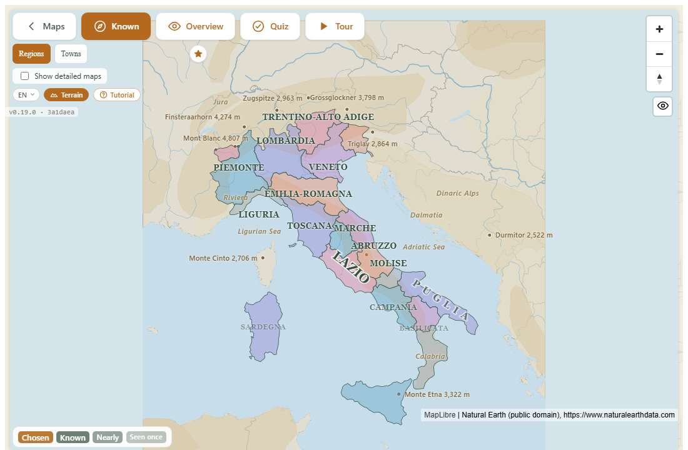

**Top left, the map bar:**

- **‹ Maps**: back to the start screen.
- **Known**, **Overview**, **Quiz**, **Tour**: the four modes of this map, each
  with a small icon (a compass, an eye, a tick in a circle, a play triangle).
  The current one is filled orange with white text; the others are white with
  orange text.

### The type row

Under the map bar, a row of buttons lists the other maps of the same country
or continent: here **Regions** (the open one, in orange) and **Towns**. Press
one to switch to it without going back to the start screen; the row wraps onto
a second line rather than scrolling.

- **The star** at the end of the row marks the map as a favourite (filled and
  orange when it is one).
- **Show detailed maps** is a tick below the row. Ticked, the row also lists
  the country's detailed maps:

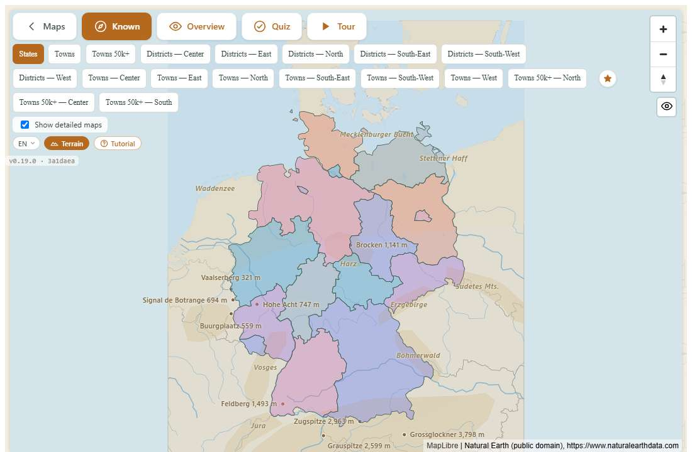

- A detailed map you have opened stays in the row, with a large **red X** on its
  button. The X sends it back behind the tick again. It does not show on the map
  you are in, or while the tick is on.

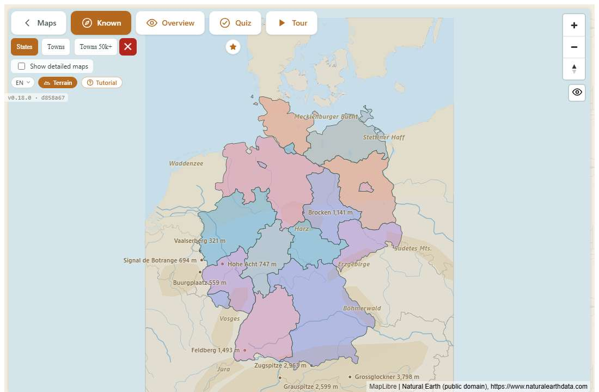

### The other controls

- **EN ⌄**: the language menu (English, Deutsch, Italiano):

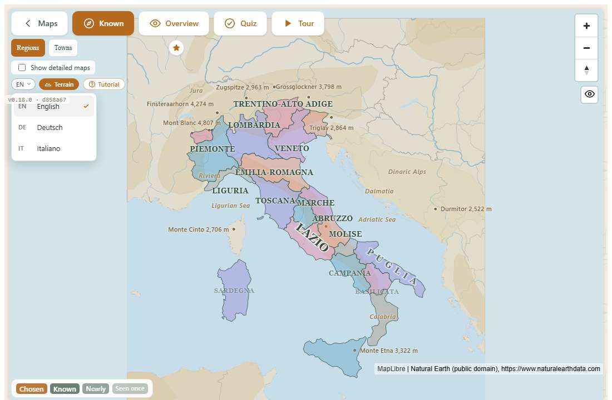

- **Terrain**: shows or hides the landscape behind the map (see
  [Terrain](#13-terrain)).
- **Tutorial**: starts the tutorial.
- **On the quiz only**, a line showing your progress: "Drag each name onto its
  region — 5 / 20 placed", with a note such as "3 names at a time" when the
  quiz holds names back.

**Top right:**

- **+** and **−** zoom in and out.
- **The arrow** below them turns the map back to "north up" if it has been
  rotated (with a right-button drag on a computer, or a two-finger twist on a
  touch screen). Most players never rotate the map.
- **The eye** hides the map bar, the type row and the pills so that the map has
  the whole screen, which helps in a quiz on a small tablet. Press it again to
  bring them back. The choice lasts until you close the app.

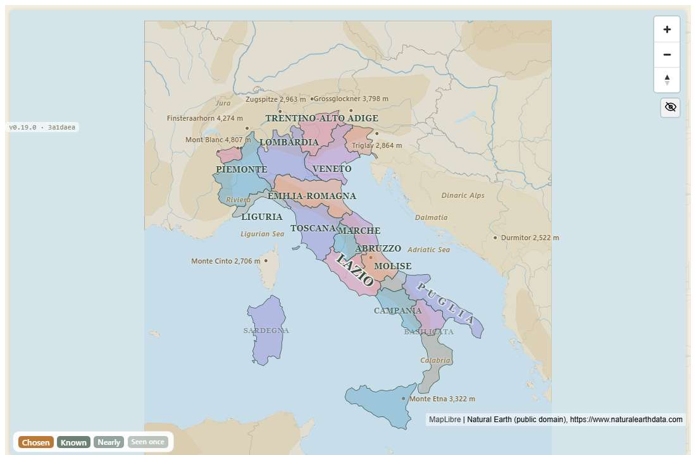

**Bottom right:** a line of small print saying where the map's data comes from
(on a phone it starts folded behind an ⓘ). **The version badge** is at the top
left.

### Moving around the map

On every map screen the map can be zoomed and moved:

| | With a mouse or trackpad | On a touch screen |
|---|---|---|
| Zoom in or out | the mouse wheel, a trackpad pinch, or **+** / **−** | pinch with two fingers, or **+** / **−** |
| Zoom in one step | double-click | double-tap |
| Move the map | drag it | drag with one finger |

A drag or pinch can start anywhere, including on a name written on the map.

### Colours

On Known, Quiz and Tour, regions are painted in soft pinks, blues, purples,
oranges and greys, chosen so that neighbouring regions never share a colour. On
the Overview every region is the same green, because none of them is hidden
from you there. In the quiz, green means *placed*.

## 6. Known: the map you build

A map opens here. It shows the names you have earned, and the ones you choose:

A name is written on the map for either of two reasons:

- **You have placed it right in the quiz** at least once. It is drawn as
  strongly as you know it:

| How the name looks | What it means |
|---|---|
| **Known**, solid | you have placed it right **three times in a row**, with no mistake |
| **Nearly**, lighter | twice in a row |
| **Seen once**, faint | once |

- **You tapped it.** It is then drawn as **Chosen**.

A small legend in the bottom-left corner names the four styles. Names you have
never placed cleanly are left off until you tap their place.

**Tap a place to put its name on the map; tap it again to take it off.** Tapping
a place whose name is already shown hides it, so you decide which names are in
front of you. Choosing a second place does not remove the first. A **Clear**
button appears in the legend while you have made choices, and puts the map back
to what you have earned. Your choices last for the sitting: when the app is
reopened, the map shows what you know and nothing else.

Every tap also opens the place's **fact card**, with its name and something
about it:

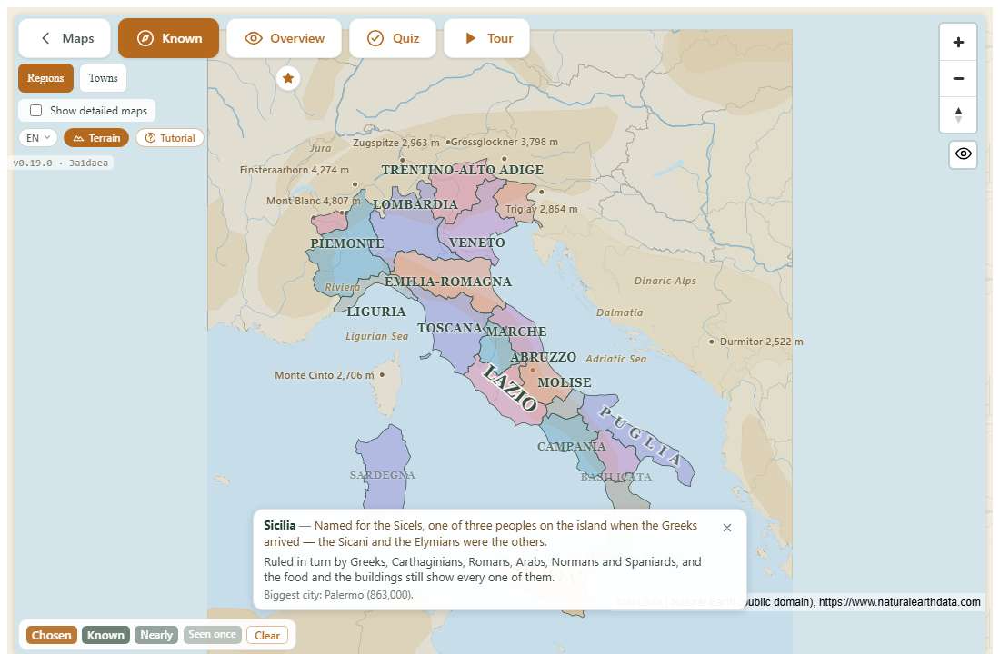

Because a mistake sets a name back to nothing, this map is an honest picture of
what you actually know. Nothing here is scored. On a towns map, tap a town's dot.

## 7. Overview: see every name

Every region (or town) has its name written on it, in white on a dark green
label. This is the screen to study from. Nothing is scored here.

**Names never overlap.** A name that has no room where it belongs first tries a
line above or below its place, or is stretched along the region where it fits.
Only when nothing is free is it left out, the way an atlas does, rather than
printing two names on top of each other. When two names want the same spot, the
larger region keeps its name. Nothing is lost: **zoom in** and the names that
were left out appear as room is made for them. Names stay the same size on
screen at every zoom level; they're pinned to the middle of their region.

**Enlarging a name:** names are small so that they fit, but any one of them can
be enlarged. With a mouse, point at it; on a touch screen, tap it (tap it
again, or tap anywhere else, to shrink it back). The name grows to about one and
a half times its size, darkens, and sits on top of its neighbours:

Tapping a place also opens its fact card (see [Facts](#12-facts-and-name-origins)).

## 8. Quiz: drag the names onto the map

The quiz is the game. The map is shown in colour without names, and the names to
place are in a **tray** along the bottom of the screen, in alphabetical order.
Here the quiz on Denmark's five regions, at the start:

The line under the type row counts your progress: "Drag each name onto its
region — 0 / 5 placed".

On a map you have not learned, the tray holds **ten names at a time** and
refills as you place them. Once you know a map, it holds back more (see
[Fewer names as you improve](#fewer-names-as-you-improve)).

### Dragging a name

Press on a name in the tray (with the mouse button, a finger or a pen), drag it
over the map, and let go on the region you think it belongs to. While you drag,
the name follows the pointer, and the region under it lights up blue:

The blue highlight only shows *where* you are, not whether it's right. It's the
same colour on every region.

- **Letting go on the sea, off the map, or back on the tray** doesn't count as
  anything: the name simply goes back to the tray. That's the way to change your
  mind in the middle of a drag.
- **Small regions** (a city-state like Berlin, or Molise in Italy) are
  forgiving: a drop just next to them still counts for them. The forgiveness
  only ever helps the right answer.

### Right

The region turns green, its name stays written on it, and the name leaves the
tray. The counter goes up:

### Wrong: one mistake ends that name's turn

There are no second tries. The region you dropped on flashes red for a moment,
and at the same time the name is placed where it really belongs, so the mistake
shows you the answer. That name is marked differently from one you placed
yourself: its region turns a muted gold-brown instead of green, and its label is
brown. A fact card about it stays up until your next drop, because that is the
moment worth reading it.

A name shown after a mistake counts as a mistake in your score, and sends that
name's streak back to zero, so it has to be placed right three more rounds
running to count as known again (see [What counts as known](#9-what-counts-as-known)).

### Fewer names as you improve

A map gets harder as you learn it. Geoclick counts how many of its names you
know and offers fewer names at a time as that share grows:

| Names of the map you know | The tray offers | Note beside the progress line |
|---|---|---|
| under a quarter | 10 at a time | *(none)* |
| a quarter or more | 6 at a time | "6 names at a time" |
| 60 % or more | 3 at a time | "3 names at a time" |
| 85 % or more | 1 at a time | "one name at a time" |

The tray refills as you place names, so there is always something to drag until
the round is done; the names you haven't placed yet simply wait their turn.

Why it gets harder: with every name in front of you, the last few drops of a
round can be worked out by elimination. With one name at a time, you have to
know where it goes.

### Resizing the tray

The short grey bar at the top of the tray is a handle. Drag it up to make the
tray taller, or down to see more of the map. With a keyboard, move to the handle
with Tab and use the arrow keys. When there are more names than fit, the tray
scrolls. When the quiz opens, the map is fitted into the space above the tray, so
no region starts hidden under it.

### The end of a quiz

When the last name is placed, a panel appears over the map with your score:

- **"Done!"**
- **"5 / 5 placed correctly on the first try."** A name counts only if it was
  right on the very first drop.
- **"2 total mistakes."** All wrong drops together.
- **"2 shown after a mistake."** Only when some names had to be shown.
- **"14 / 20 known"** (with "· 3 names at a time" when it applies): where the
  round leaves you.
- **×**, top-right, closes the panel so you can look at the finished map. To
  play a new round on that map, choose **Play again** on the map. The map bar's
  **Maps** button returns to the start screen.

### Every round is the whole map

A quiz always asks for every name on the map. There is no shorter "review
round" and no separate practice mode: you play the map, and Geoclick keeps track
of how well you know each name as you go.

### Leaving in the middle

You can step out of a round and come back to it. Looking a name up in the
**Overview** and returning to the **Quiz** leaves the round exactly as it was:
the names you placed are still marked, and the tray still holds the ones you
haven't. Reloading the page, or coming back another day, starts a fresh round.

### What the quiz needs

The quiz is played by dragging, so it needs a mouse, a trackpad, a finger or a
pen. It can't be played with the keyboard alone.

## 9. What counts as known

Geoclick keeps one number for every place on every map: how many times in a row
you have placed it right **with no mistake**. That is its *clean streak*.

| What happened in the quiz | The place's streak |
|---|---|
| **Right on the first try** | one higher |
| **Shown after a mistake** | back to zero |
| **Never played** | zero |

A place counts as **known** at a streak of three. That one number drives
everything you see:

- the bar on the map's card in [My maps](#14-my-maps-favourites-and-recent);
- the Known map, where a known name is written at full strength, a streak of two
  more lightly, and a streak of one faintly;
- how many names the quiz offers at a time.

Because one mistake resets a streak, a name becomes known only by being placed
right three rounds running, and stops being known if you later fumble it.

Underneath, Geoclick also keeps a review date for each place (the *spaced
repetition* idea that flashcard apps such as Anki use). Nothing in the app shows
those dates, and nothing stops you playing any map at any time.

What is kept is kept per device: see [Your data and privacy](#19-your-data-and-privacy).

## 10. Tour: a guided flight over the map

The tour flies over the map on its own, one place at a time, roughly from north
to south. At each stop it zooms in, lights the place up in orange, and shows its
name and a fact about it, then moves on after a few seconds. It starts playing as
soon as the screen opens:

The compact controls at the bottom of the screen use icons: a left arrow goes
back one stop, play/pause starts or stops the tour, the circular arrow replays it
from the beginning, and the right arrow skips to the next stop. Previous and next
are disabled at the beginning and end. Each icon has an accessible name (and a
tooltip on hover).

- **"Step 2 of 20"** shows the stop you're on, out of how many.
- The speed menu offers 0.5×, 0.75×, 1×, 1.5×, 2× and 3×. A tour starts at
  normal speed, except on very big maps, where it starts faster, so that the
  whole tour takes about three minutes.

Nothing is scored. The map can still be zoomed and moved during the tour.

## 11. Towns maps

A towns map is about cities rather than regions: the towns and cities of roughly
100 000 inhabitants or more (50 000 on some countries, a selection of the
biggest on the largest). Each town is a **dot**, and the country's regions are
drawn faintly underneath for reference.

The Overview names every town. A town's name sits **beside** its dot, never on
top of it, taking the first free side (right, left, above or below), so the dot
you are looking for is always visible:

Everything else works as on a regions map. In the quiz, drop each name onto its
town's dot:

- The dots are painted in different colours so that close neighbours are easy to
  tell apart.
- A drop counts for the town whose dot is **closest** to where you let go,
  within a small distance. So dropping between two close towns counts for the
  nearer one. A town is easier to hit than its dot: the tap area is larger.
- The progress line says "Drag each name onto its region" on towns maps too.

The United States is the one country whose cities come as four maps: the 50 over
a million, and three slices at 200 000: East, Center and West.

## 12. Facts and name origins

Every place on every map has a few sentences of its own, in your language. The
first is usually about the **name**: where the word comes from, who it is named
after, what it meant. Hiroshima is "wide island"; Lombardia is named for the
Longobards, the "long-beards"; Chicago is a word for wild garlic. Where an
origin is disputed, the sentence says so.

A **fact card** opens at the bottom of the screen:

- when you **tap a place** in Known or the Overview;
- **after you drop a name** in the quiz, so it can never give an answer away
  (after a mistake it stays until your next drop);
- at every **stop of the tour**.

The card also has a line worked out from the map itself: where the place is,
whether it has a coast, what range it lies in, its biggest city, its highest
point, who it borders. It shows a different sentence each time you meet a place.
**×** closes it.

## 13. Terrain

The **Terrain** button in the map bar's second row shows or hides the landscape
behind the map. It is on by default. With it on, you see the sea, the rivers and
the named seas, ranges, deserts and peaks around the map, with their heights, in
your language; empty stretches of sea carry old sea-chart decorations. Turning
it off leaves just the map, with land and sea still told apart.

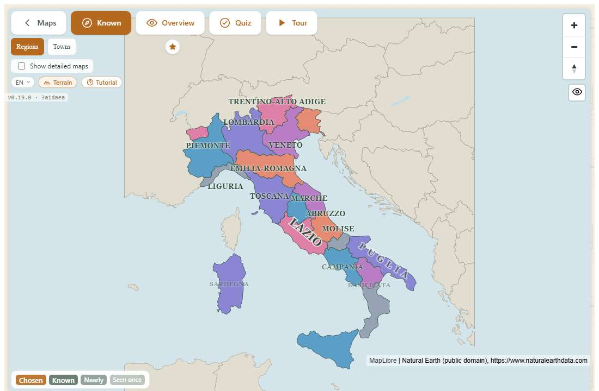

Terrain names do not get in the way: a click goes through them to the place
underneath.

## 14. My maps: favourites and recent

Press the **★** in the start screen's toolbar. The page holds two lists:

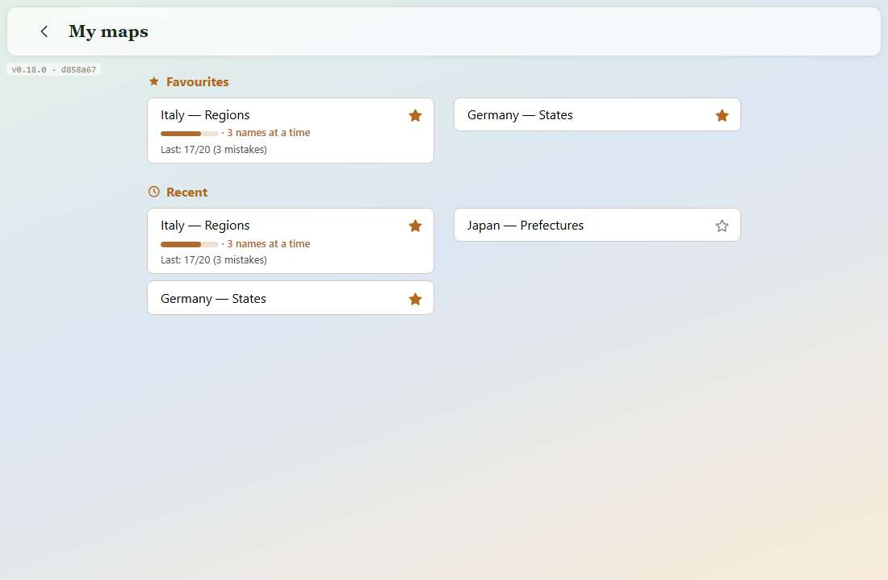

- **Favourites (★):** every map you've starred. Star a map with the star on its
  card here, or with the star at the end of the type row on any map screen. Click
  a filled star to unstar it. Favourites stay in the order you starred them.
- **Recent (🕘):** the last five maps you opened, newest first. Opening a map on
  any of its screens counts, and opening one again moves it to the top. A map can
  be in both lists.

Each card shows the map's name, and once you have played it:

| On the card | Meaning |
|---|---|
| a **bar** | how much of the map you know (orange, green when you know all of it); its accessible name says "14 / 20 known" |
| **"· 3 names at a time"** | the quiz now holds names back (see [Fewer names as you improve](#fewer-names-as-you-improve)) |
| **"Last: 17/20 (3 mistakes)"** | your last finished quiz on this map: 17 of 20 places right on the first try, 3 wrong drops in total. The mistakes part is left out when there were none |
| *(nothing)* | you have never played this map's quiz |

Both lists are kept on the device only. The number on the toolbar's star counts
the maps in both.

## 15. The tutorial

The tutorial is a hands-on walkthrough: it doesn't show a video, it asks you to
do the real thing on the real screens, and waits until you have. It always ends
up on Italy — Regions, takes about three minutes, and works in English, German
and Italian.

**The tutorial's practice on Italy — Regions doesn't change your real
progress.** Its quiz uses a separate, temporary record, and Italy — Regions
doesn't land in Recent. If you leave the tutorial and play another map while it
is paused, that map behaves normally and records your progress.

### Starting it

- the **Tutorial** button (or the **?** in the start screen's toolbar); or
- **Start the tutorial** on the first-visit box.

It opens with a welcome card:

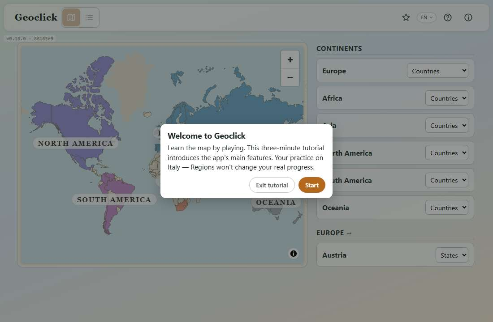

**Start** begins; **Exit tutorial** closes it.

### What it looks like

Each step is a white card with the step number ("Step 1 of 14"), a short
instruction, and buttons. The rest of the screen is dimmed, except for the thing
the step is about, which is outlined in orange. Everything on the screen still
works during the tutorial; the dimming is only there to draw the eye.

### The steps

| Step | Where | The card says (English) | Moves on when |
|---|---|---|---|
| 1 | start screen, the world map | "Every map starts from the world. Choose **Europe**." | the map opens Europe |
| 2 | start screen, Europe | "Now click **Italy** on the map. Its row in the list lights up." | you click Italy |
| 3 | start screen, Europe | "Choose **Regions** in Italy's row to open that map." | you open Italy — Regions |
| 4 | the Known map | "Zoom with the mouse wheel or the **+** and **−** buttons, and drag the map to move around. Try it now." | you zoom or move the map |
| 5 | the Known map | "This is **Known**, the map you build. Click a region to put its name on the map — it stays there. Click it again to take it off, so you choose which names to study." | you click a region and its name lands on the map |
| 6 | the Known map | "**Terrain** adds geographic detail behind the map, including rivers, mountain ranges and the sea overlay. The land and sea remain distinct when Terrain is off. Press **Terrain** to hide or show this extra detail." | you press **Terrain**, either direction |
| 7 | the Known map, then overview | "Names you place right in the quiz appear here on their own, as strongly as you know them. New to a map? **Overview** shows every name at once — open it." | you open the Overview |
| 8 | overview | "Ready for a quiz? Open the **Quiz**." | you open the Quiz |
| 9 | quiz | "Drag a name from the tray onto its region. Try **Sicilia**: the big island off the toe of the boot." | you place any name correctly |
| 10 | quiz | "Now get one wrong on purpose: drag **any** name onto a region it does not belong to — **Sardegna** onto the mainland, say. The region you hit flashes red, and the name is shown where it really belongs." | you make a wrong drop |
| 11 | quiz | "Not sure where a region is? Look it up in the **overview**." | you open the Overview |
| 12 | overview | "Found Sardegna? Go back to the **Quiz**." | you open the Quiz |
| 13 | quiz | "The regions you placed are still marked. Place a name right three times in a row and it counts as known — **Known** shows how far you have got." | you press **Next** |
| 14 | quiz | "Last one: the **Tour** flies you to each region in turn and shows its name. Open it." | you open the Tour |

The first three steps show the map even if you chose the list; the list comes
back after the tutorial. On touch screens the steps say "tap", "pinch" and "drag
with one finger" instead of mentioning the mouse. In the quiz steps the card sits
at the top, so it never covers the tray or the island you're asked to find.

The last card, on the Tour, says "You're all set" and offers **Finish**, which
ends the tutorial and leaves you on the tour, and **Replay**, which starts it
again.

### The buttons on the cards

- **Next** appears on the explanation step (13) and on a step whose required
  action you've already done.
- **Back** goes to the previous step, and to its screen if that's somewhere
  else.
- **Exit tutorial** ends the tutorial at once. The **Esc** key does the same.

### Wandering off

If you go somewhere the step didn't ask for (another map, the list of maps, a
different tab), the tutorial pauses. The card is replaced by a small bar at the
bottom of the screen:

- **Resume** takes you back to where the step is and shows its card again.
- **End tutorial** ends it.

The tutorial never carries on by itself while paused. Reloading the page or
closing the app also ends it.

## 16. Languages

The whole interface is available in **English**, **German** and **Italian**.
Switch with the **EN ⌄** menu, on the start screen or on any map screen; the
change is immediate and remembered on the device.

What changes and what doesn't:

- **Translated:** every button, heading and message, the tutorial, the kind of
  map ("Regions" / "Regionen" / "Regioni", "Towns" / "Städte" / "Città"), the
  facts and name origins of every place, the terrain names (Alps / Alpen / Alpi),
  and the names of countries and of the towns on the maps of several countries:
  Italy is "Italien" in German and "Italia" in Italian.
- **Not translated:** the regions of a country's own maps keep their names in
  the country's own language (Toscana, Bayern, Île-de-France), which is how they
  appear on local maps.

## 17. On a phone

The phone version has the same screens and features, arranged for a narrow
screen. The start screen, with the toolbar and the map above its panel:

On map screens, the buttons of the map bar are stacked icon over label and share
the width of the screen:

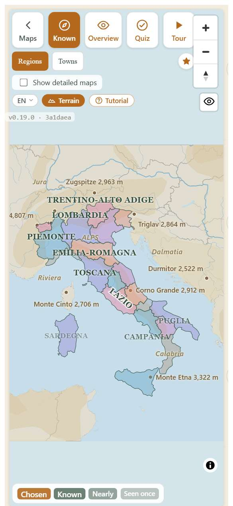

On a phone, the fact card shows one line at a time. The quiz tray starts at up to
about a third of the screen, and scrolls:

### Gestures

- **Drag with one finger** to move the map; **pinch** to zoom; **double-tap** to
  zoom in one step.
- **Drag a name** from the quiz tray with your finger.
- **Tap** a name on the Overview to enlarge it.

### The Android back button

In the Android app, the phone's back button goes **up one level** rather than back
through every screen you've visited:

- from a map's Quiz, Overview or Tour, back to that map's Known screen;
- from a map's Known screen, back to the start screen;
- from the start screen, it closes the app.

In a web browser on a phone, the browser's own back button works as in any
website.

## 18. The Windows and Android apps

The apps are the same game as the website, packaged to install:

- **Same screens and features**, including the tutorial and all three languages.
  The differences are that the "Download for Windows or Android" link isn't shown
  inside the apps, and that they have an **Exit** button on the start screen.
- **The maps are built in**, so the apps don't need the internet to play.
- **Progress is kept inside the app**, separately from any browser on the same
  device (see [Your data and privacy](#19-your-data-and-privacy)).
- **Updating:** install the new version over the old one. Progress, favourites
  and settings are kept.
- The version badge in the corner shows which version is installed.

## 19. Your data and privacy

- **No account.** There's nothing to sign up for or log in to.
- **Nothing leaves the device.** Your progress isn't sent anywhere; there is no
  Geoclick server holding it.
- **Kept on the device, per browser or app.** Geoclick remembers, on the device
  where you play:
  - how well you know each place, and each map's last result;
  - your favourites and recent maps, and the detailed maps you have opened;
  - the language you chose, and whether Terrain is on;
  - whether you've seen or dismissed the tutorial offer.
- **Consequences:**
  - playing on a phone and on a laptop gives two separate progress records; they
    don't sync;
  - two different browsers on the same computer also keep separate records, and
    so do the app and a browser;
  - clearing the browser's data for the site erases Geoclick's progress in that
    browser, and uninstalling the Android app erases it on the phone.

## 20. The maps

156 maps across 53 countries and the six continents.

- **Continents.** Each continent has a **Countries** map and a **Capitals** map.
  Europe's cities also come in five parts (north, south, east, west and centre).
- **Countries.** 53 countries have maps of their own: Argentina, Australia,
  Austria, Bangladesh, Belgium, Brazil, Bulgaria, Canada, Chile, China, Colombia,
  Croatia, Czech Republic, Denmark, Egypt, Finland, France, Germany, Greece,
  India, Indonesia, Iran, Ireland, Italy, Japan, Kazakhstan, Kenya, Malaysia,
  Mexico, Netherlands, New Zealand, Nigeria, Norway, Peru, Philippines, Poland,
  Portugal, Romania, Russia, Saudi Arabia, Serbia, South Africa, South Korea,
  Spain, Sweden, Switzerland, Thailand, Turkey, Ukraine, United Kingdom, United
  States of America, Venezuela and Vietnam. Most have **regions** (states,
  provinces, prefectures…) and **towns**.
- **Detailed maps** (behind the *Show detailed maps* tick): Germany's districts
  and its towns of 50 000 and up, Italy's 110 provinces (also in north, centre and
  south thirds) and its towns of 50 000 and up, Poland's counties, the
  Netherlands' municipalities, France's departments, the Philippines' provinces,
  and similar. On the biggest, only about half the names fit at the zoom the map
  opens at; the rest appear as you zoom in.
- **The United States** has four city maps: **Cities** (the 50 over a million)
  and three slices at 200 000, East, Center and West, split at the Mississippi
  and the Rockies. A city that two maps both cover, such as Chicago, counts on
  each of them separately.
- Maps show the country's main territory; far-away overseas territories are left
  out.
- **Where the data comes from.** Natural Earth, a free public-domain world map,
  for most borders, and geoBoundaries (CC0 or open licences, credited on each
  map) where Natural Earth is out of date or missing. Towns and some facts come
  from Wikidata. Each map's own small print says what it uses.

## 21. Questions and answers

**Can I lose my progress?** Only by clearing the browser's data for the site, or
uninstalling the Android app. There's no way to lose it by playing: the tutorial
doesn't touch it, and a round you leave changes only the names you actually
placed.

**Why did my "known" count go down?** A place stops counting as known the moment
you get it wrong: its streak goes back to zero, and it takes three clean rounds
to earn it again. See [What counts as known](#9-what-counts-as-known).

**The tray only offered me three names. Why?** Because you know most of that map.
The better you know it, the fewer names the quiz puts in front of you, so the
last few can't be worked out by elimination. See
[Fewer names as you improve](#fewer-names-as-you-improve).

**I dropped a name and nothing happened.** You let go on the sea, outside the
map, or on the tray. That doesn't count; drag it again.

**A region is too small to hit.** Zoom in first (mouse wheel, pinch or **+**).
Small regions also accept drops just next to them.

**Can I see a name while playing the quiz?** Not on the quiz screen; that's the
point. Switch to **Overview** to look it up, then back to **Quiz**. The places
you've already placed are still placed when you come back.

**Where is the map I want?** Use the search box on the start screen. If it is a
detailed map, open a map of the same country and tick **Show detailed maps**.

**A button of mine has a red X. What does it do?** It is a detailed map you
opened earlier. The X puts it back behind the tick.

**Can I play on two devices?** Yes, but each device keeps its own progress.

**How do I see the tutorial offer again?** Press **Tutorial** at any time; the
one-time offer box itself doesn't come back.

**Which version do I have?** Look at the grey badge at the top left of any screen,
or at the About page, for example `v0.18.0 · d858a67`.

**Windows says the installer is from an unknown publisher.** It isn't
code-signed; choose *More info*, then *Run anyway*.

**Who makes Geoclick?** Diego Amicabile. The source code is at
https://github.com/diegoami/Geoclick2027.

## 22. Glossary

| Term | Meaning |
|---|---|
| **Map** | One set of places to learn, for example Italy — Regions. |
| **Place** / **target** | One region, state, province, town or country on a map. |
| **Known** | The map you build: each name earned in the quiz drawn as strongly as you know it, plus the names you tap. |
| **Overview** | The map with its names shown, as many as fit without overlapping (a town's name sits beside its dot); zoom in for the rest. |
| **Quiz** | The game: drag each name from the tray onto the map. |
| **Tour** | The automatic flight from place to place. |
| **Tray** | The strip of names at the bottom of the quiz. |
| **Slip** | One name in the tray. |
| **Placed** | Dropped on the right place (green). |
| **Shown** | Placed for you after a mistake (gold-brown); counts as not known. |
| **Clean streak** | How many times in a row you have placed a name right with no mistake. |
| **Known (place)** | A place with a clean streak of three or more. |
| **Round** | One playing of a map's quiz: every name, from blank to done. |
| **Detailed map** | A finer map (districts, provinces, towns of 50 000…) kept behind *Show detailed maps*. |
| **Favourites** | Maps you've starred. |
| **Recent** | The last five maps you opened. |
| **Map bar** | The row of buttons at the top of every map screen. |
| **Type row** | The row under the map bar listing the country's other maps. |
| **Fact card** | The card with a place's name origin and facts. |
| **Version badge** | The small grey version number at the top left. |
