# Geoclick — User manual

This manual explains Geoclick to someone who wants to understand it
without installing or running it. Every screen is shown with a
screenshot, and every button, label and message is explained: what it
looks like, what it does, and what the player sees in return.

It describes **Geoclick v0.5.0** (14 September 2026).

The screenshots come from the web version, on a laptop-sized window
(1280 × 800) and on a phone-sized screen. The Windows and Android apps
show exactly the same screens (see [Getting Geoclick](#2-getting-geoclick)).
The progress shown in the screenshots (how much of each map is known,
favourites and so on) is realistic example data.

## Contents

1. [What Geoclick is](#1-what-geoclick-is)
2. [Getting Geoclick](#2-getting-geoclick)
3. [How the screens fit together](#3-how-the-screens-fit-together)
4. [The home page](#4-the-home-page)
5. [Map screens: what they have in common](#5-map-screens-what-they-have-in-common)
6. [Overview: see every name](#6-overview-see-every-name)
7. [Progress: what you know so far](#7-progress-what-you-know-so-far)
8. [Quiz: drag the names onto the map](#8-quiz-drag-the-names-onto-the-map)
9. [What counts as known](#9-what-counts-as-known)
10. [Tour: a guided flight over the map](#10-tour-a-guided-flight-over-the-map)
11. [Towns maps](#11-towns-maps)
12. [Favourites and Recent](#12-favourites-and-recent)
13. [The tutorial](#13-the-tutorial)
14. [Languages](#14-languages)
15. [On a phone](#15-on-a-phone)
16. [The Windows and Android apps](#16-the-windows-and-android-apps)
17. [Your data and privacy](#17-your-data-and-privacy)
18. [The maps](#18-the-maps)
19. [Questions and answers](#19-questions-and-answers)
20. [Glossary](#20-glossary)

---

## 1. What Geoclick is

Geoclick is a game for learning geography: where a country's regions,
states or provinces are, and where its main towns and cities are.

- **48 maps of 22 countries.** Most countries have two maps: its regions
  (called states, provinces, prefectures or districts, depending on the
  country) and its larger towns. Italy also has its 110 provinces. See
  [The maps](#18-the-maps) for the full list.
- **Four ways to use each map:**
  - **Overview:** the whole map with the names written on it, to look at
    and learn from — as many as fit without overlapping, the rest a zoom
    away;
  - **Progress:** how well you know the map — every name you have placed
    right, drawn as strongly as you know it; click a region to find out
    what it is;
  - **Quiz:** the game itself. Drag each name from a tray onto the map;
  - **Tour:** the map flies from place to place on its own, showing each
    name in turn.
- **It remembers what you know.** Place a name right three times in a row
  with no mistake and it counts as known; one mistake and that name starts
  again. The home page shows how much of each map you know, and the better
  you know a map, the fewer names its quiz offers at a time.
- **Three languages:** English, German and Italian. Place names stay in the
  local language (Italian regions are called "Toscana", not "Tuscany").
- **No account, no sign-up.** Everything is kept on the device you play on.
- **Three ways to play:** in a web browser, as a Windows app, or as an
  Android app. All three are the same game.
- **A built-in tutorial** walks a new player through all of it, in about
  three minutes.

## 2. Getting Geoclick

- **In a web browser:** open https://zesty-centaur-40e7c5.netlify.app/.
  Nothing to install; it works in any recent browser, on a computer or a
  phone.
- **Windows and Android apps:** download them from the public releases
  page, https://github.com/diegoami/geoclick-releases/releases/latest.
  The web version's home page links there too ("Prefer an app? Download
  for Windows or Android", see [The home page](#4-the-home-page)).
  - **Windows:** run the `-setup.exe` file (or the `.msi`). Windows
    SmartScreen warns about an "unknown publisher", because the installer
    isn't code-signed; choose *More info*, then *Run anyway*.
  - **Android:** open the `.apk` file on the phone and allow Android to
    install apps from unknown sources when it asks. Geoclick isn't in the
    Play Store.
- **Previews:** the releases page sometimes also has *alpha* or *beta*
  versions, marked as pre-releases with a warning. They're test builds of
  the next version; the one marked *Latest* is the normal one.

The Windows app is a window showing the same screens as the website:

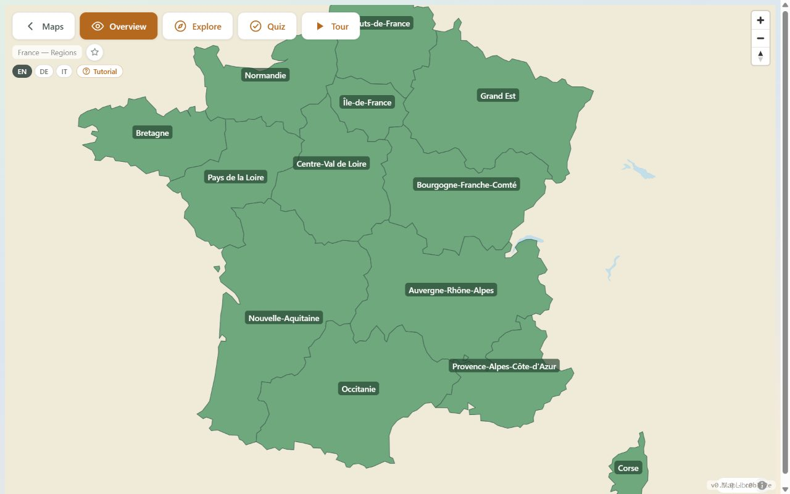

The Android app fills the phone screen, under the phone's own status bar:

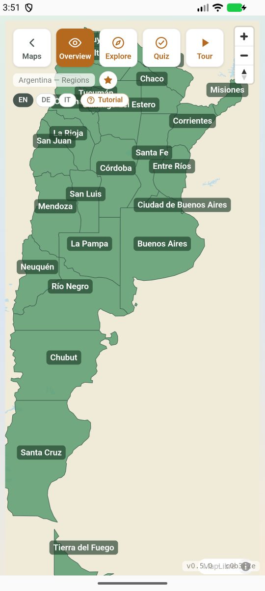

## 3. How the screens fit together

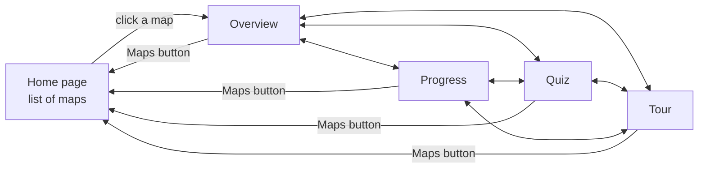
```mermaid
flowchart LR
    H[Home page<br/>list of maps] -->|click a map| O[Overview]
    O <--> E[Progress]
    O <--> Q[Quiz]
    O <--> T[Tour]
    E <--> Q
    Q <--> T
    E <--> T
    O & E & Q & T -->|Maps button| H
```

- The **home page** lists every map.
- Clicking a map opens it on its **Overview**.
- On every map screen, a row of buttons at the top (the *map bar*)
  switches between **Overview**, **Progress**, **Quiz** and **Tour** for
  that map, or goes back to the list (**Maps**).
- The **Tutorial** can be started from the home page or from any map
  screen, and it takes you through all of these screens in turn.

Every screen has a web address of its own, for example
`/map/italy-regions/quiz` for the Italy — Regions quiz, so a screen can be
bookmarked or shared as a link.

## 4. The home page

This is the first screen. It lists all the maps, and above them the ones
you use most.

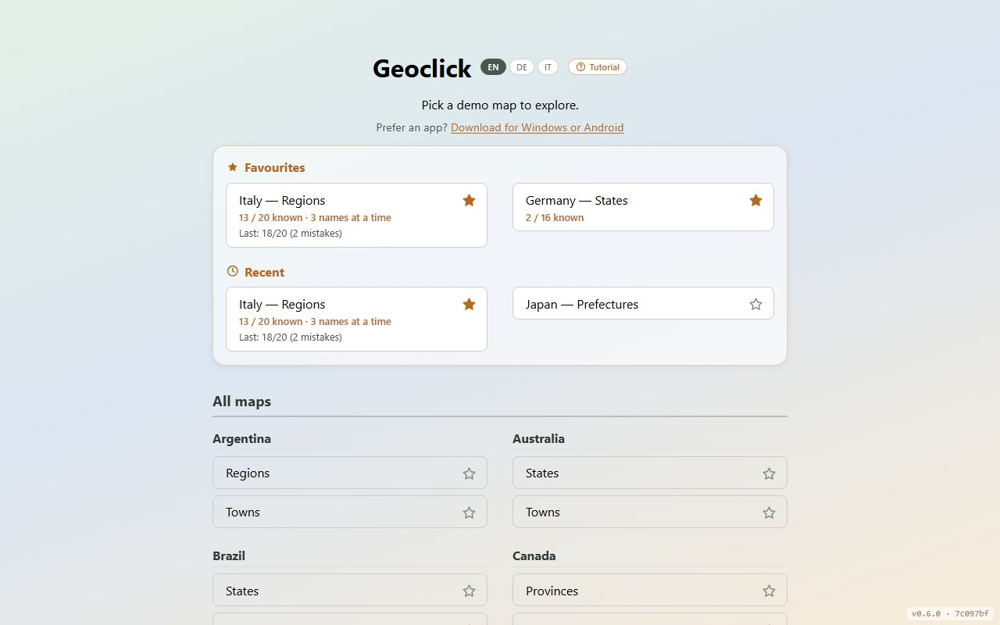

From top to bottom:

- **"Geoclick"**, the title.
- **EN · DE · IT**, three small pills next to the title: the language
  switch. The current language is the dark pill. Clicking another one
  switches the whole app at once (see [Languages](#14-languages)).
- **Tutorial**, an orange-outlined pill with a question mark: starts the
  [tutorial](#13-the-tutorial).
- **"Pick a demo map to explore."**, a one-line welcome.
- **"Prefer an app? Download for Windows or Android"**: a link to the
  releases page. It only appears in the web version, not inside the apps.
- **The Favourites and Recent panel**, a white-ish panel with a thin
  orange border (see [Favourites and Recent](#12-favourites-and-recent)):
  - **★ Favourites:** the maps you've starred, in the order you starred
    them;
  - **🕘 Recent:** the last five maps you opened, newest first.

  The panel only appears once there is something in it.
- **All maps**, a larger heading with a line under it, then every country
  in alphabetical order, with its maps under it. When the panel isn't
  shown, the country list starts right after the welcome line.
- **The version badge**, in small grey type at the bottom-right corner of
  every screen: the version number and a short build code, for example
  `v0.5.0 · 160840e`. Useful when reporting a problem.

### Map cards

Each map is a card. On the country list, the card shows the kind of map
("Regions", "Towns"…) under the country's heading; in Favourites and
Recent, it shows the full name ("Italy — Regions"). A card can have up to
two extra lines:

| Line | Colour | Meaning |
|---|---|---|
| **"14 / 20 known"** | orange | You know 14 of this map's 20 places — a place counts as known once you have placed it right three times in a row with no mistake (see [What counts as known](#9-what-counts-as-known)). |
| **"20 / 20 known"** | green | You know the whole map. |
| **"· 3 names at a time"** | | Added to that line once the map is known well enough for the quiz to hold names back (see [Fewer names as you improve](#fewer-names-as-you-improve)). |
| *(no line)* | | You've never played this map's quiz. |
| **"Last: 17/20 (3 mistakes)"** | grey | Your last finished quiz on this map: 17 of 20 places right on the first try, 3 wrong drops in total. It leaves out the mistakes part when there were none ("Last: 16/16"). |

Clicking anywhere on a card opens that map's [Overview](#6-overview-see-every-name).

The **star** at the right of every card marks the map as a favourite:
an empty outline star means it isn't one; an orange filled star means it
is. Clicking the star doesn't open the map. It only stars or unstars it,
and the Favourites section updates at once. A map starred in one place is
starred everywhere: in the country list, in Favourites, in Recent and in
the map bar.

### The whole list

The full home page, scrolled from top to bottom:

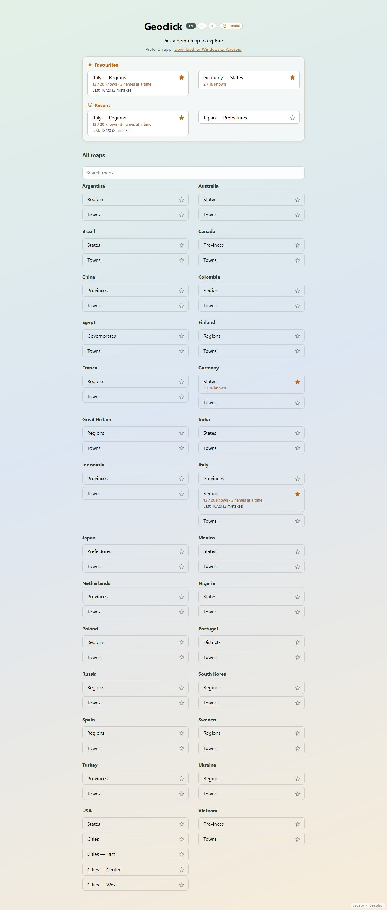

On a wide screen the countries sit in two columns; on a phone, in one.

### The first visit

On a device that has never used Geoclick, the panel isn't there yet, and
a beige box offers the tutorial instead:

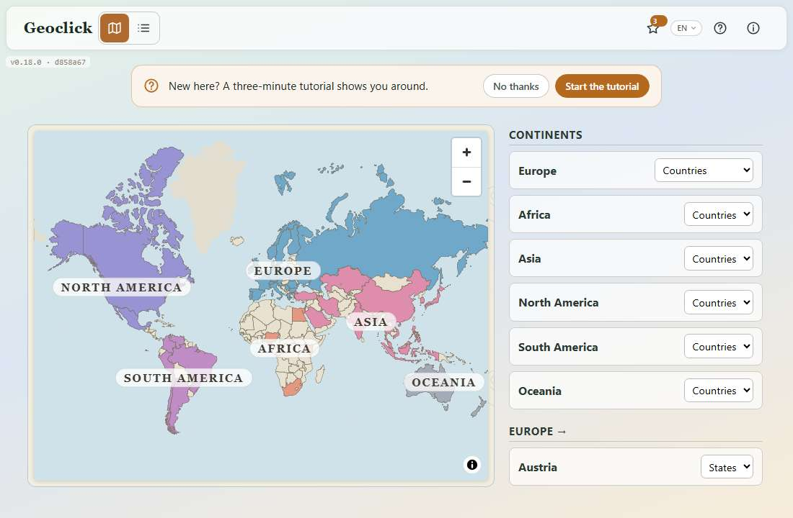

- **"New here? A three-minute tutorial shows you around."**
- **Start the tutorial** (orange) starts it.
- **No thanks** hides the box.

Either way the box never comes back on that device. It also disappears
for good once the tutorial has been started from anywhere. Nothing ever
starts by itself.

## 5. Map screens: what they have in common

Every map screen (Overview, Progress, Quiz and Tour) has the same frame
around the map. Here it is on the Overview of Italy — Regions:

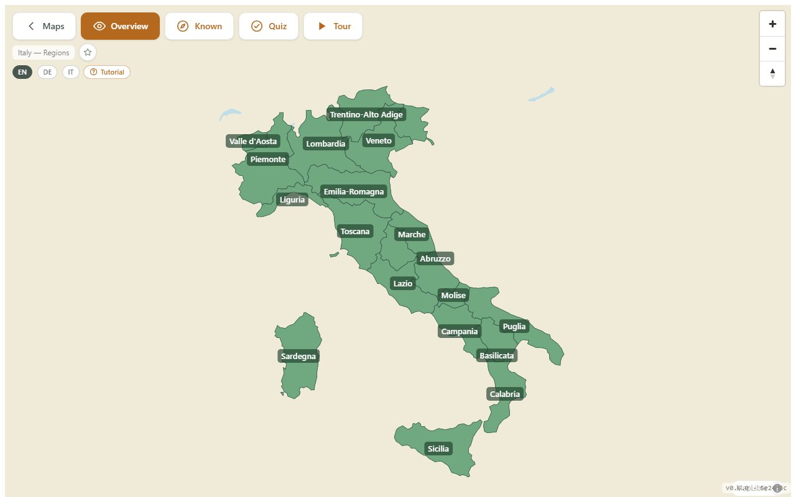

**Top-left, the map bar:**

- **‹ Maps**: back to the home page.
- **Overview**, **Progress**, **Quiz**, **Tour**: the four modes of this
  map, each with a small icon (an eye, a compass, a tick in a circle, a
  play triangle). The current one is filled orange with white text; the
  others are white with orange text.

**Under the map bar:**

- **The map's name**, in a small grey chip: "Italy — Regions". The country
  name stays in English in every language (see [Languages](#14-languages)).
- **The star** next to it: the same favourite switch as on the home page
  cards, in a small white circle.
- **On the quiz only**, a line showing your progress: "Drag each name
  onto its region — 5 / 20 placed".
- **EN · DE · IT** and **Tutorial**, as on the home page.

**Top-right, the zoom buttons:**

- **+** and **−** zoom in and out.
- **The arrow** below them turns the map back to "north up" if it has been
  rotated (with a right-button drag on a computer, or a two-finger twist on
  a touch screen). Most players never rotate the map.

**Bottom-right:** the version badge, and MapLibre's small ⓘ credit button
(MapLibre is the map engine; the button shows the map's data credits).
The two overlap slightly on some screens.

### Moving around the map

On every map screen the map can be zoomed and moved:

| | With a mouse or trackpad | On a touch screen |
|---|---|---|
| Zoom in or out | the mouse wheel, a trackpad pinch, or **+** / **−** | pinch with two fingers, or **+** / **−** |
| Zoom in one step | double-click | double-tap |
| Move the map | drag it | drag with one finger |

A drag or pinch can start anywhere, including on a name written on the
map. Names never get in the way of moving the map.

### Colours

On Progress, Quiz and Tour, regions are painted in soft pinks, blues,
purples, oranges and greys, chosen so that neighbouring regions never
share a colour. On the Overview every region is the same green, because
none of them is hidden from you there. In the quiz, green means *placed*.

## 6. Overview: see every name

Opening a map always lands here. Each region (or town) has its name
written on it, in white on a dark green label:

This is the screen to study from. Nothing is scored here.

**Names never overlap.** A name that has no room where it belongs first
tries a line above or below its place. Only when nothing is free is it
left out — the way an atlas does, rather than printing two names on top of
each other. Here is Italy — Provinces, which
has 110 of them, as it opens: about fifty names, each of them legible:

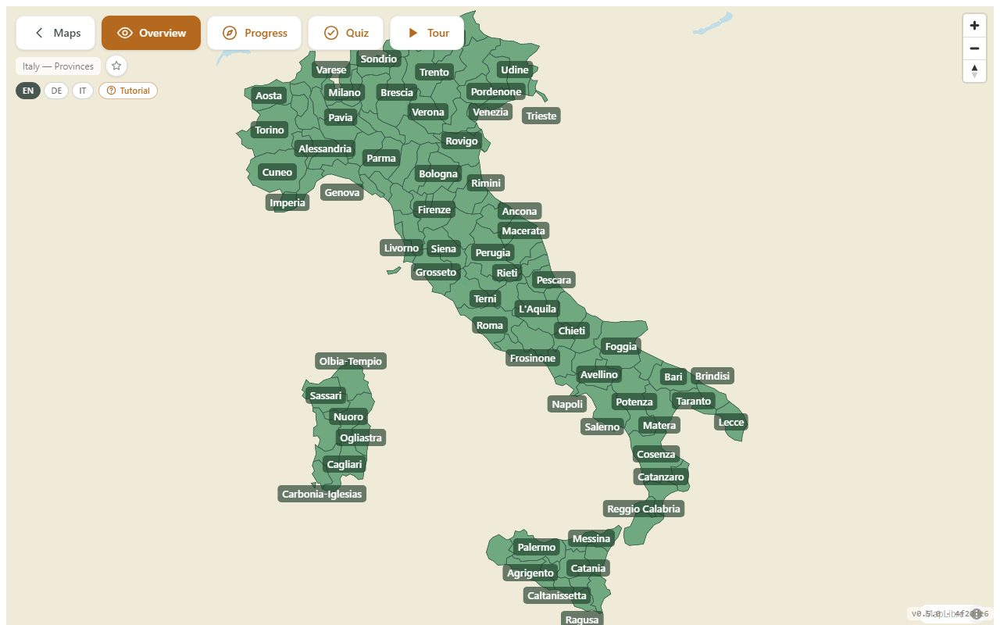

When two names want the same spot, the larger region keeps its name.
Nothing is lost: zoom in and the names that were left out appear as room
is made for them. The same map after three clicks on **+**, now naming
Viterbo, Rieti, Frosinone and Latina, which were not written before:

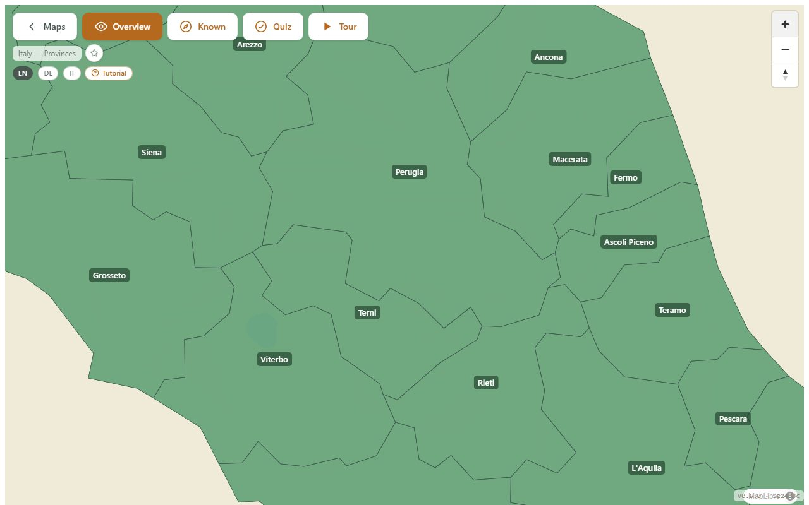

**Enlarging a name:** names are small so that they fit, but any one of
them can be enlarged. With a mouse, point at it; on a touch screen, tap
it (tap it again, or tap anywhere else, to shrink it back). The name grows
to about one and a half times its size, darkens, and sits on top of its
neighbours:

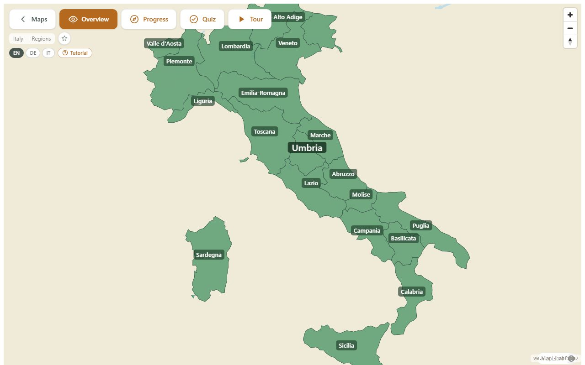

**Zooming in** spreads the names apart, and brings in any that were left
out. Here Italy — Regions after two clicks on **+**:

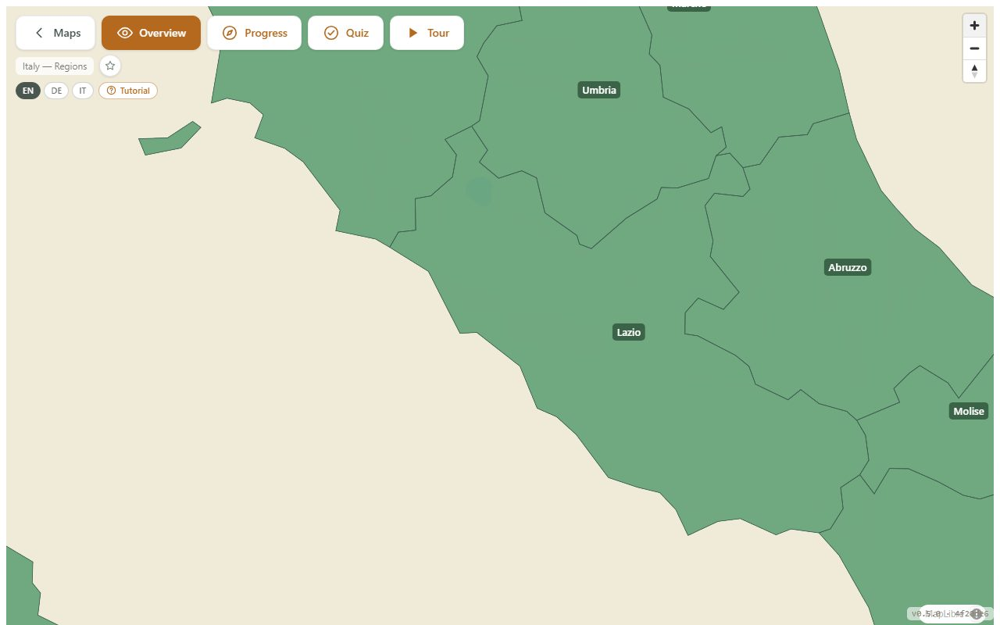

Names stay the same size on screen at every zoom level; they're pinned to
the middle of their region.

## 7. Progress: what you know so far

This tab shows how well you know the map. Every name you have placed
right in a quiz is written on it, as strongly as you know it; names you
have never placed cleanly are left blank:

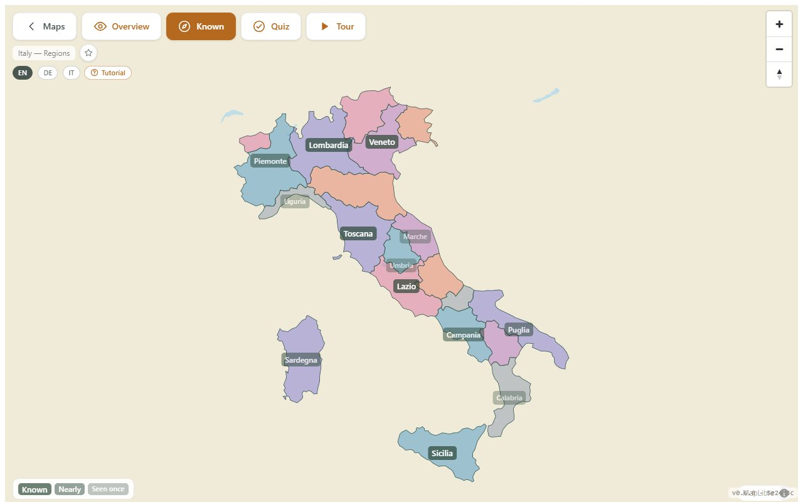

| How the name looks | What it means |
|---|---|
| solid | you have placed it right **three times in a row**, with no mistake |
| lighter | twice in a row |
| faint | once |
| not written at all | never placed right, or you have made a mistake on it since |

A small legend in the bottom-left corner says the same. Point at a faint
name (or tap it) to read it at full strength.

Because a mistake sets a name back to nothing, this map is an honest
picture of what you actually know, not of what you have visited.

**It is also the old Explore.** Click (or tap) any region and it turns
orange and gives its name where you clicked, whether or not you know it:

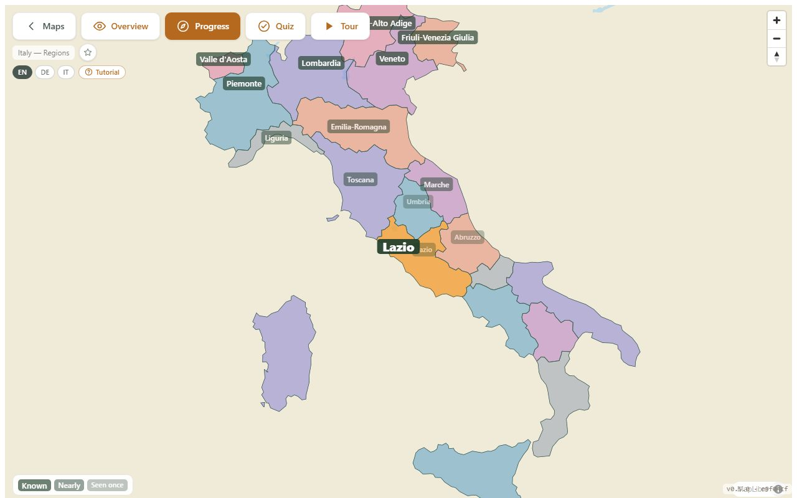

Clicking another region moves the highlight and the name there. Nothing
here is scored or saved. On a towns map, click a town's dot.

Until v0.5.0 this tab was called **Explore** and showed a blank map to
test yourself against. It still does that on a map you have never played,
since nothing is known yet.

## 8. Quiz: drag the names onto the map

The quiz is the game. The map is shown in colour without names, and the
names to place are in a **tray** along the bottom of the screen, in
alphabetical order. On a map you haven't learned yet, every name is there
at once; once you know it well the tray holds back most of them (see
[Fewer names as you improve](#fewer-names-as-you-improve)):

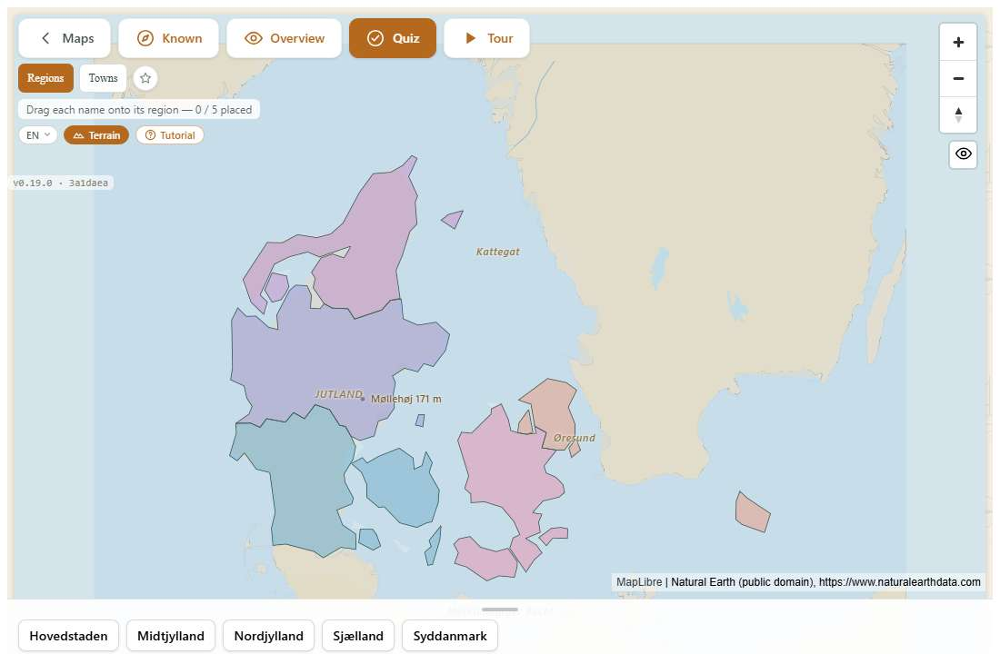

The line under the map name counts your progress: "Drag each name onto
its region — 0 / 20 placed".

### Dragging a name

Press on a name in the tray (with the mouse button, a finger or a pen),
drag it over the map, and let go on the region you think it belongs to.
While you drag, the name follows the pointer as a white label, and the
region under it lights up blue:

The blue highlight only shows *where* you are, not whether it's right.
It's the same colour on every region.

- **Letting go on the sea, off the map, or back on the tray** doesn't
  count as anything: the name simply goes back to the tray. That's the way
  to change your mind in the middle of a drag.
- **Small regions** (a city-state like Berlin, or Molise in Italy) are
  forgiving: a drop just next to them still counts for them. The
  forgiveness only ever helps the right answer. Dropping near a small
  region never counts as a drop on it if you're holding a different
  name.

### Right

The region turns green, its name stays written on it, and the name leaves
the tray. The counter goes up:

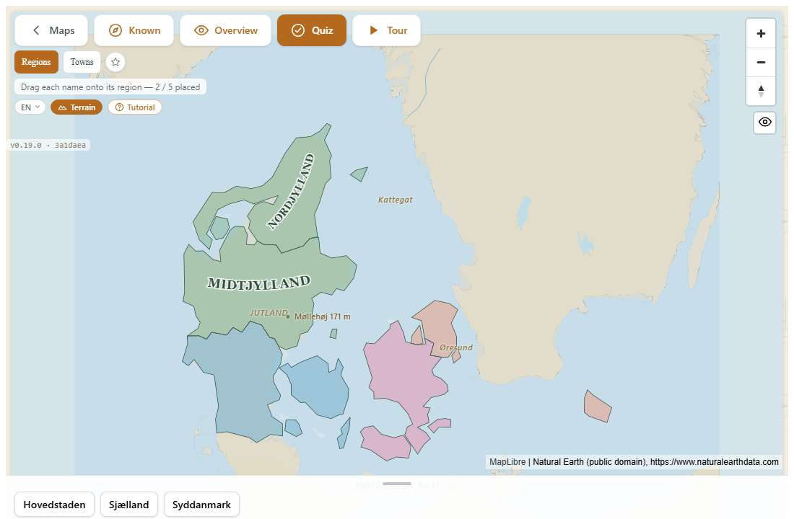

### Wrong: one mistake ends that name's turn

There are no second tries. The region you dropped on flashes red for a
moment, and at the same time the name is placed where it really belongs,
so the mistake shows you the answer:

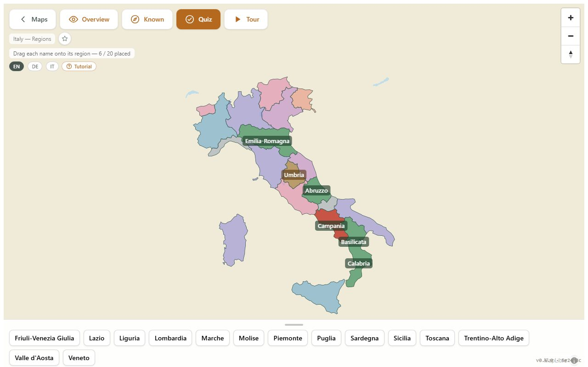

The name is marked differently from one you placed yourself: its region
turns a muted gold-brown instead of green, and its label is brown. It
counts as a mistake in your score, and it sends that name's streak back to
zero, so it has to be placed right three more rounds running to count as
known again (see [What counts as known](#9-what-counts-as-known)):

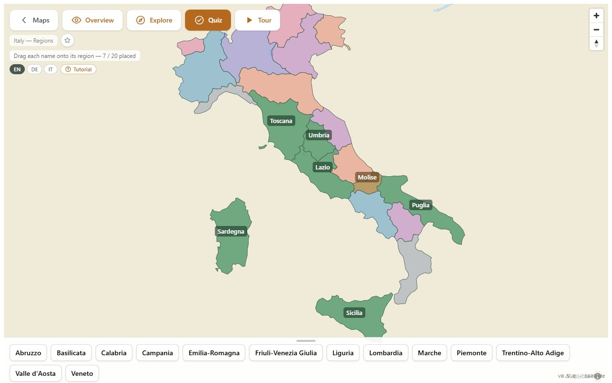

Until v0.5.0 a name could be tried three times before it was given away.
Since v0.6.0 one mistake is enough, so a round asks you to know a name,
not to narrow it down.

### Fewer names as you improve

A map gets harder as you learn it. Geoclick counts how many of its names
you know — a name counts once you've placed it right three times in a row
with no mistake — and offers fewer names at a time as that share grows:

| Names of the map you know | The tray offers | Note beside the progress line |
|---|---|---|
| under a quarter | every name | *(none)* |
| a quarter or more | 6 at a time | "6 names at a time" |
| 60 % or more | 3 at a time | "3 names at a time" |
| 85 % or more | 1 at a time | "one name at a time" |

The tray refills as you place names, so there is always something to drag
until the round is done; the names you haven't placed yet simply wait
their turn.

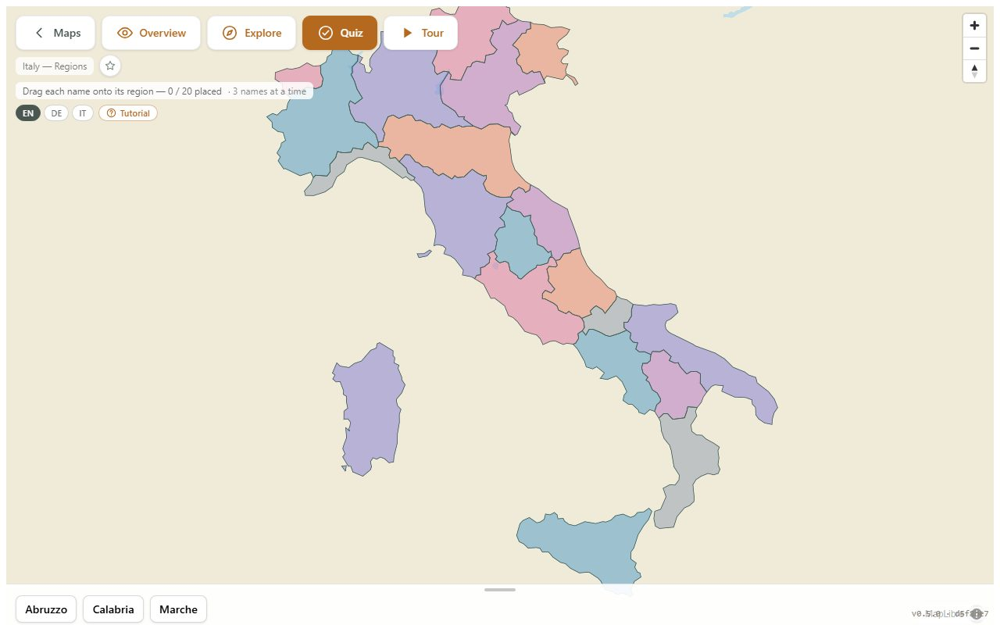

Why it gets harder: with every name in front of you, the last few drops of
a round can be worked out by elimination, and a map you know plays exactly
like the first time. With one name at a time, you have to know where it
goes.

### Resizing the tray

The short grey bar at the top of the tray is a handle. Drag it up to make
the tray taller (to see more names at once on a big map), or down to see
more of the map. With a keyboard, move to the handle with Tab and use
the arrow keys. When there are more names than fit, the tray scrolls.

When the quiz opens, the map is fitted into the space above the tray, so
no region starts hidden under it.

### The end of a quiz

When the last name is placed, a panel appears over the map with your
score:

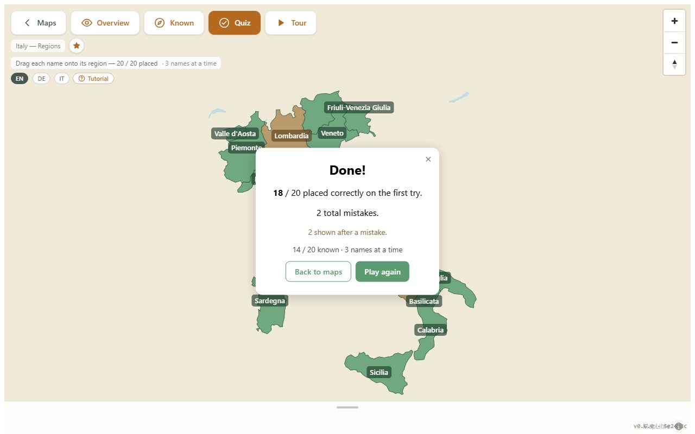

- **"Done!"**
- **"18 / 20 placed correctly on the first try."** A name counts only if
  it was right on the very first drop.
- **"2 total mistakes."** All wrong drops together.
- **"2 shown after a mistake."** Only when some names had to be shown.
- **"14 / 20 known · 3 names at a time"** — where the round leaves you,
  the same line the map's card shows on the home page.
- **Back to maps** returns to the home page.
- **Play again** plays the map again, from blank.
- **×**, top-right, closes the panel so you can look at the finished map:

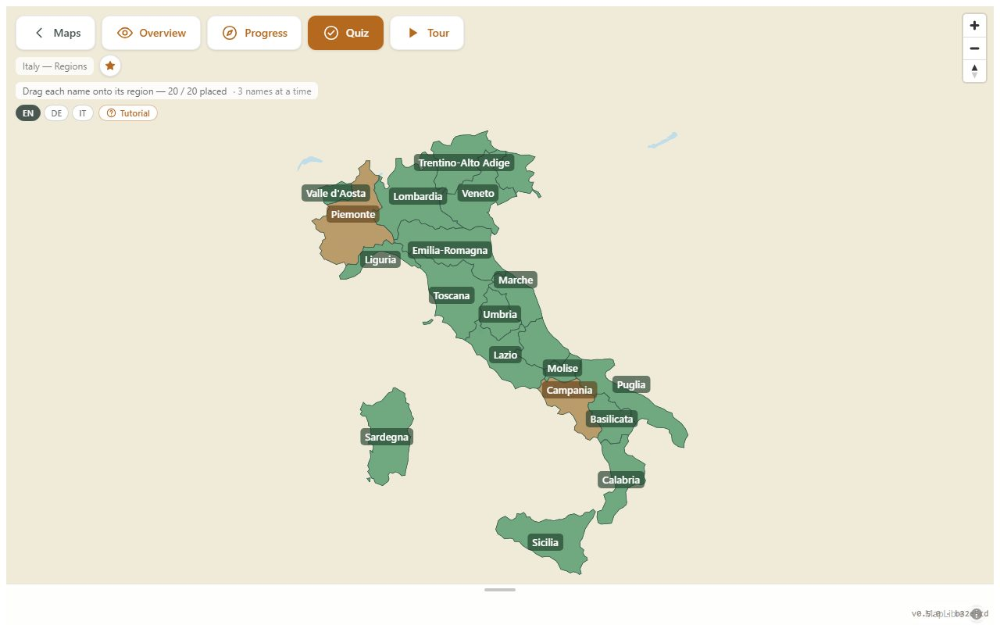

### Every round is the whole map

A quiz always asks for every name on the map. There is no shorter "review
round" and no separate practice mode: you play the map, and Geoclick keeps
track of how well you know each name as you go (see
[What counts as known](#9-what-counts-as-known)).

### Leaving in the middle

You can step out of a round and come back to it. Looking a name up in the
**Overview** and returning to the **Quiz** leaves the round exactly as it
was: the names you placed are still marked, and the tray still holds the
ones you haven't. Reloading the page, or coming back another day, starts a
fresh round.

### What the quiz needs

The quiz is played by dragging, so it needs a mouse, a trackpad, a finger
or a pen. It can't be played with the keyboard alone.

## 9. What counts as known

Geoclick keeps one number for every place on every map: how many times in
a row you have placed it right **with no mistake**. That is its *clean
streak*.

| What happened in the quiz | The place's streak |
|---|---|
| **Right on the first try** | one higher |
| **Shown after a mistake** | back to zero |
| **Never played** | zero |

A place counts as **known** at a streak of three. That one number drives
everything you see:

- the map's card on the home page ("14 / 20 known");
- the [progress map](#7-progress-what-you-know-so-far), where a known name
  is written at full strength, a streak of two more lightly, and a streak
  of one faintly;
- how many names the quiz offers at a time (see
  [Fewer names as you improve](#fewer-names-as-you-improve)).

Because one mistake resets a streak, a name becomes known only by being
placed right three rounds running — and stops being known if you later
fumble it.

Underneath, Geoclick also keeps a review date for each place (the *spaced
repetition* idea that flashcard apps such as Anki use), so that a later
version can suggest what to play next. Nothing in the app shows those
dates, and nothing stops you playing any map at any time.

What is kept is kept per device: see
[Your data and privacy](#17-your-data-and-privacy).

## 10. Tour: a guided flight over the map

The tour flies over the map on its own, one place at a time, roughly from
north to south. At each stop it zooms in, lights the place up in orange,
and shows its name, then moves on after a few seconds. It starts playing
as soon as the screen opens:

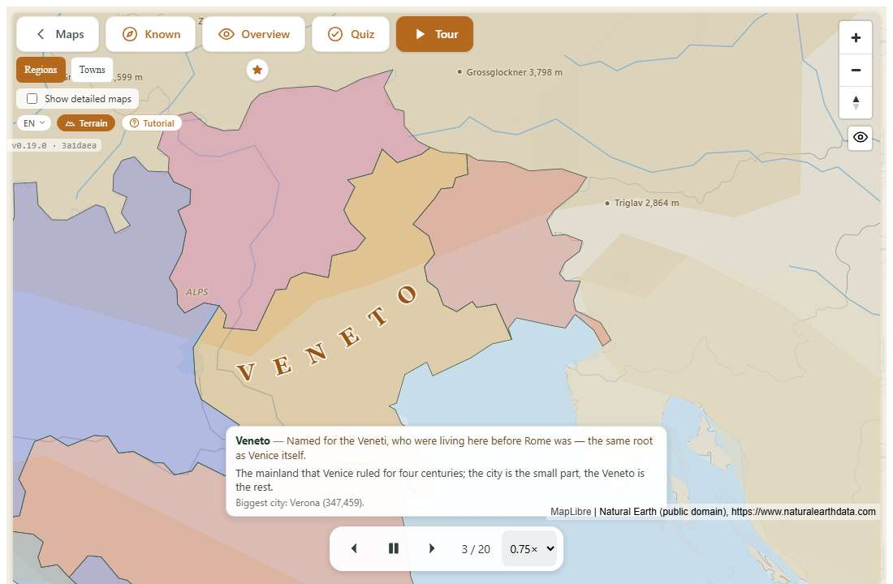

The controls, in a white bar at the bottom of the screen:

- **‹ Prev** goes back one stop (greyed out on the first one).
- **Pause** stops on the current place; it then reads **▶ Play** to carry
  on. At the end of the tour it becomes **Replay**, which starts over.
- **Next ›** skips to the next stop (greyed out once the tour has
  finished).
- **"2 / 20"**: the stop you're on, out of how many.
- **1×**, a menu for the speed: 0.5×, 1×, 1.5×, 2× or 3×. A tour starts
  at normal speed, except on very big maps (such as Italy's 110 provinces),
  where it starts faster, so that the whole tour takes about three minutes.

Nothing is scored. The map can still be zoomed and moved during the tour.

## 11. Towns maps

A towns map is about cities rather than regions: the towns and cities of
roughly 100,000 inhabitants or more (on the largest countries, a selection
of the biggest). Each town is a **dot**, and the country's regions are
drawn faintly underneath for reference.

The Overview names every town. A town’s name sits **beside** its dot,
never on top of it, taking the first free side — right, left, above or
below — so the dot you are looking for is always visible:

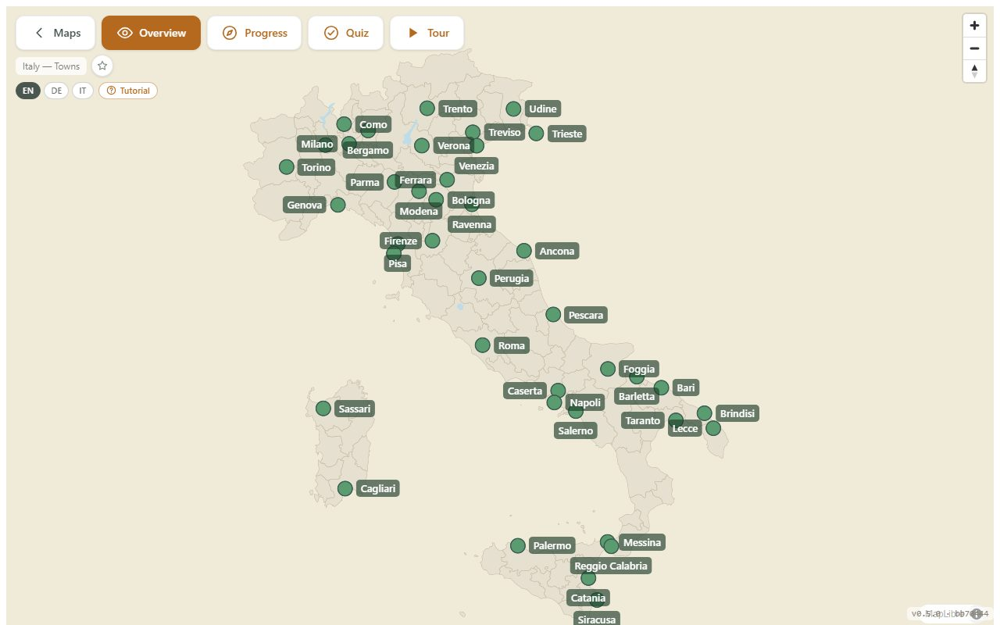

The United States is the one country whose cities come as four maps: the
50 over a million, and three slices at 200 000 — East, Center and West.
Here is the East slice, which reaches from the Great Lakes to Florida:

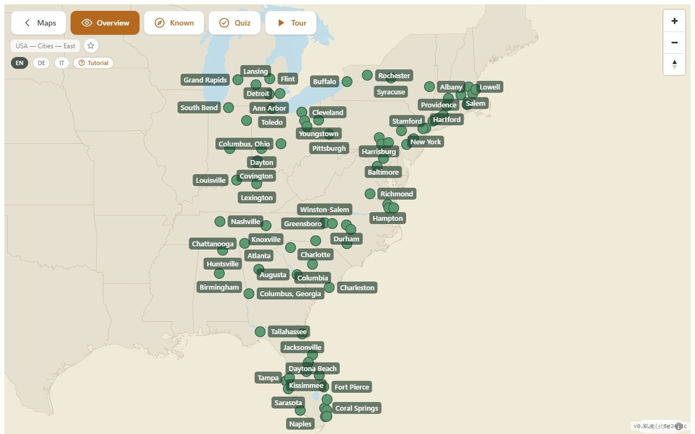

Everything else works as on a regions map. In the quiz, drop each name
onto its town's dot:

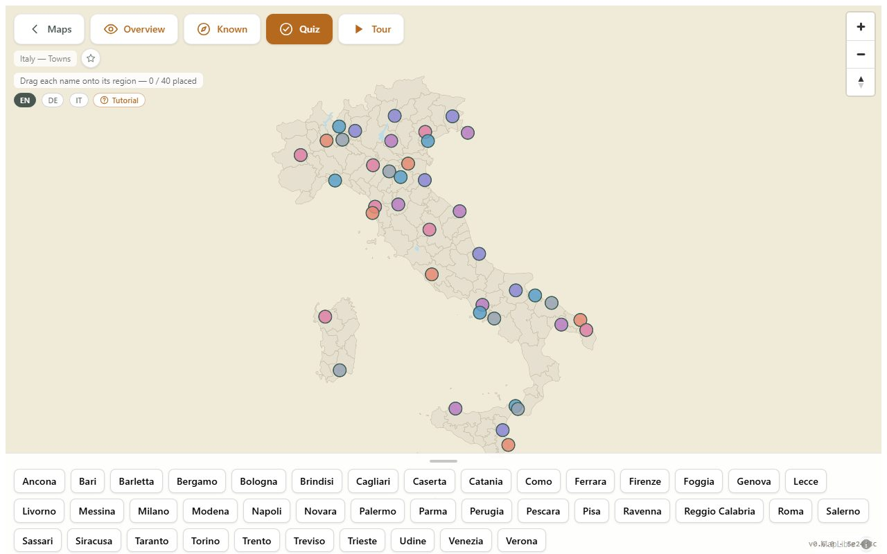

- The dots are painted in different colours so that close neighbours are
  easy to tell apart.
- A drop counts for the town whose dot is **closest** to where you let go,
  within a small distance. So dropping between two close towns counts for
  the nearer one.
- The progress line says "Drag each name onto its region" on towns maps
  too.

## 12. Favourites and Recent

Two shortcuts at the top of the home page, shown together in one panel
with an "All maps" heading below it:

- **Favourites (★):** every map you've starred. Star a map with the star
  on its card on the home page, or the star next to its name on any map
  screen. Click a filled star to unstar it. Favourites stay in the order
  you starred them.
- **Recent (🕘):** the last five maps you opened, newest first. Opening a
  map on any of its screens counts, and opening one again moves it to the
  top. A map can be in both lists, as Italy — Regions is here.

Both lists are kept on the device only. The panel disappears when both are
empty.

## 13. The tutorial

The tutorial is a hands-on walkthrough: it doesn't show a video, it asks
you to do the real thing on the real screens, and waits until you have.
It always uses Italy — Regions, takes about three minutes, and works in
English, German and Italian.

**Nothing you do in the tutorial counts.** Its quiz uses a separate,
temporary record, so your real progress on Italy — Regions (and on every
other map) is untouched, and Italy — Regions doesn't land in Recent.

### Starting it

- the **Tutorial** pill on the home page or on any map screen (from a map
  screen, it first goes back to the home page); or
- **Start the tutorial** on the first-visit box.

It opens with a welcome card:

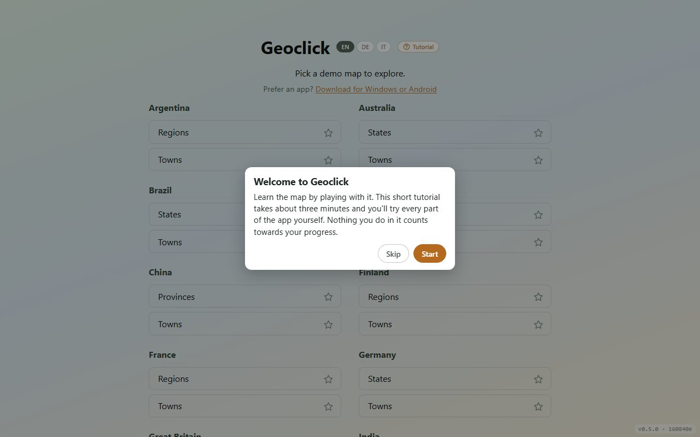

"Welcome to Geoclick. Learn the map by playing with it. This short
tutorial takes about three minutes and you'll try every part of the app
yourself. Nothing you do in it counts towards your progress." **Start**
begins; **Skip** closes it.

### What it looks like

Each step is a white card with the step number ("Step 1 of 11"), a short
instruction, and buttons. The rest of the screen is dimmed, except for the
thing the step is about, which is outlined in orange:

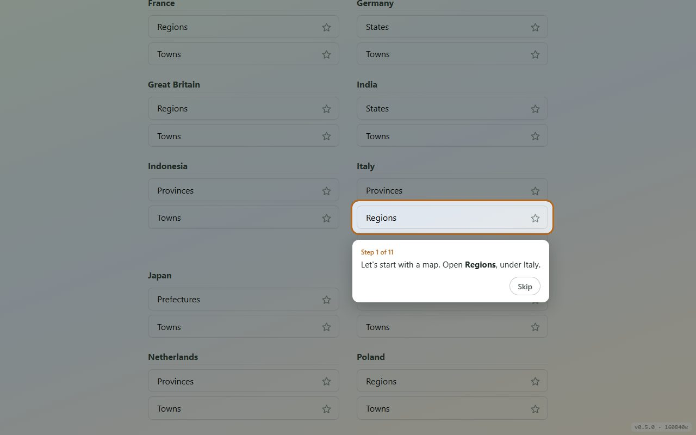

Everything on the screen still works during the tutorial; the dimming is
only there to draw the eye.

### The steps

| Step | Where | The card says (English) | Moves on when |
|---|---|---|---|
| 1 | home page | "Let's start with a map. Open **Regions**, under Italy." | you open Italy — Regions |
| 2 | Overview | "Zoom with the mouse wheel or the **+** and **−** buttons, and drag the map to move around. Try it now." | you zoom or move the map |
| 3 | Overview | "This is the **overview**, where every region shows its name. Hover over a name to enlarge it." | you press **Next** |
| 4 | Overview, then Progress | "**Progress** shows how well you know this map: the names you have placed right, as strongly as you know them. Open it and click any region to see which one it is." | you click a region on the progress map |
| 5 | Progress | "Ready to test yourself for real? Open the **Quiz**." | you open the Quiz |
| 6 | Quiz | "Drag a name from the tray onto its region. Try **Sicilia**: the big island off the toe of the boot." | you place any name correctly |
| 7 | Quiz | "Now get one wrong on purpose: drop **Sardegna** anywhere on the mainland. The region you hit flashes red, and Sardegna is shown where it really is." | you make a wrong drop |
| 8 | Quiz | "Not sure where a region is? Look it up in the **overview**." | you open the Overview |
| 9 | Overview | "Found Sardegna? Go back to the **Quiz**." | you open the Quiz |
| 10 | Quiz | "The regions you placed are still marked. Place a name right three times in a row and it counts as known — **Progress** shows how far you have got." | you press **Next** |
| 11 | Quiz | "Last one: the **Tour** flies you to each region in turn and shows its name. Open it." | you open the Tour |

On touch screens, steps 2, 3 and 4 say "pinch", "tap" and "drag with one
finger" instead of mentioning the mouse.

Step 2 outlines the zoom buttons and waits for you to move the map:

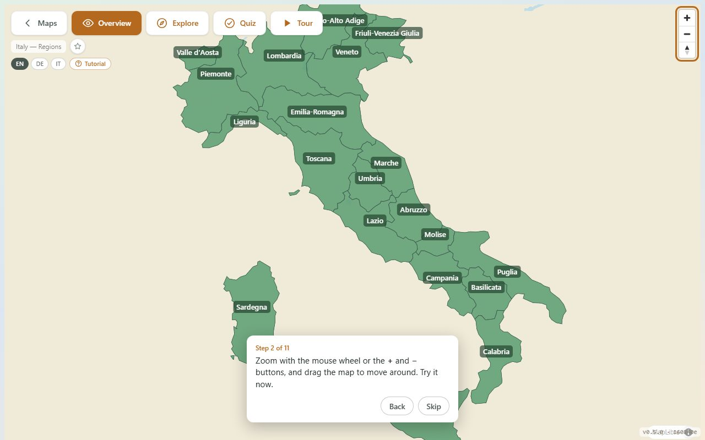

Step 3 points at the Overview button:

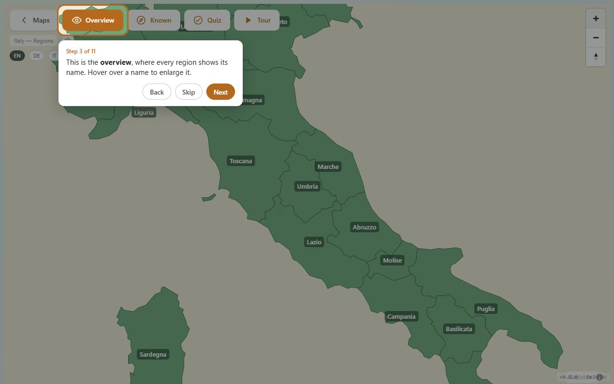

Step 4 points at Progress:

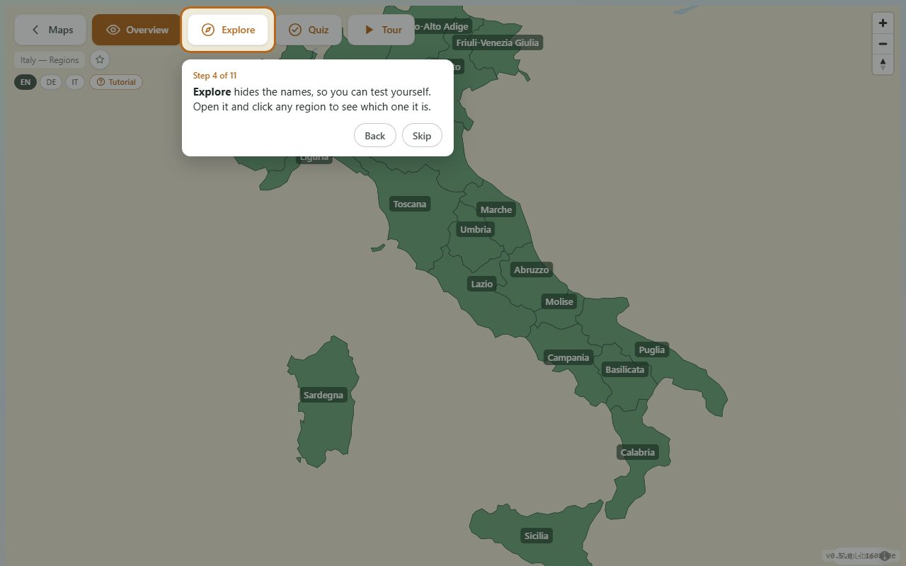

In the quiz steps the card sits at the top, so it never covers the tray
or the island you're asked to find. Step 6 outlines the Sicilia name in
the tray:

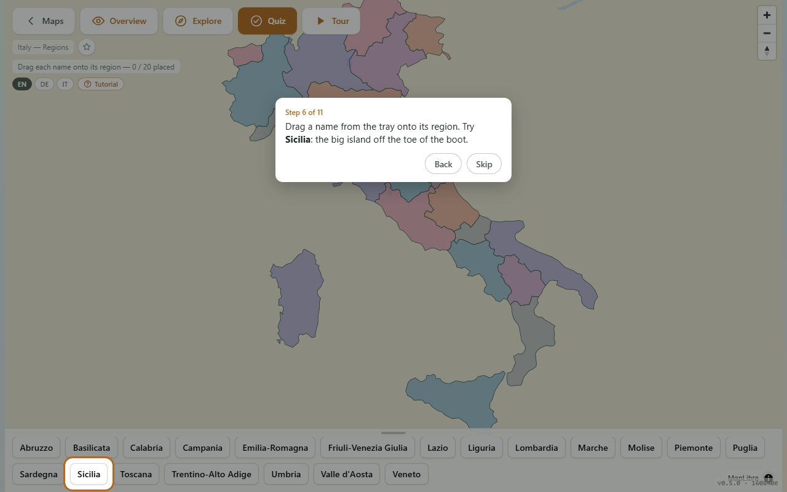

Step 7 outlines Sardegna; Sicily is already green:

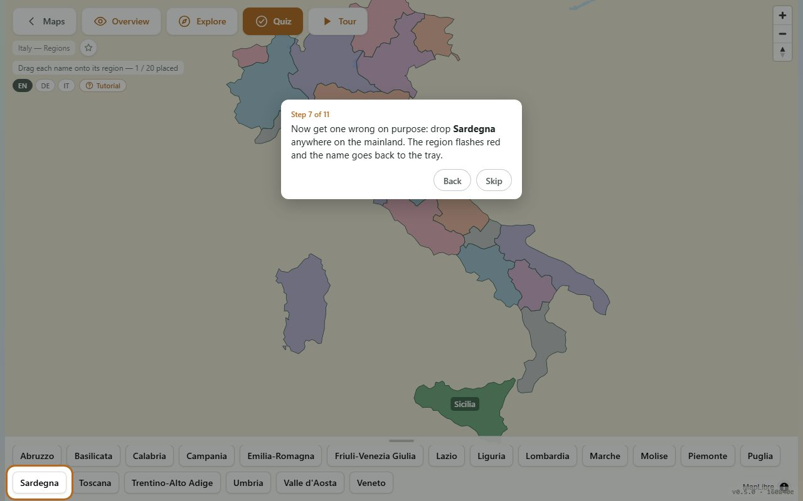

Step 10 outlines the progress line, after you've been to the Overview and
back. Sicily is still placed:

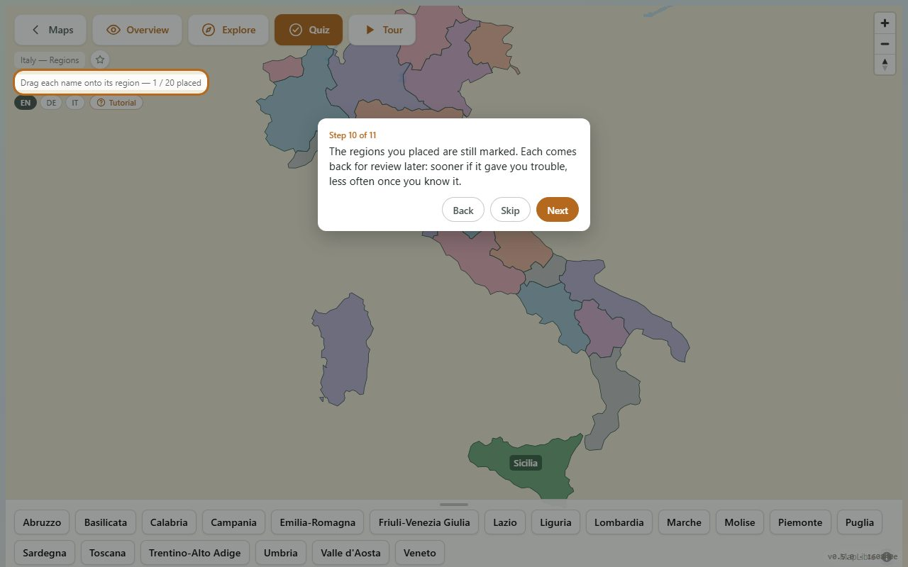

The last card appears on the Tour, which keeps playing behind it:

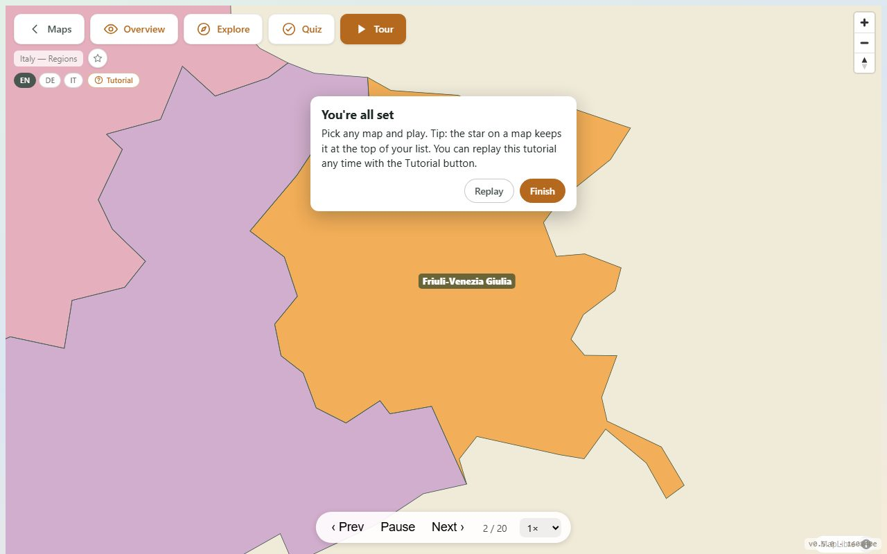

"You're all set. Pick any map and play. Tip: the star on a map keeps it
at the top of your list. You can replay this tutorial any time with the
Tutorial button." **Finish** ends the tutorial and leaves you on the tour;
**Replay** starts it again from the beginning.

### The buttons on the cards

- **Next** only appears on the two explanation steps (3 and 10), and on
  a step whose action you've already done.
- **Back** goes to the previous step, and to its screen if that's
  somewhere else.
- **Skip** ends the tutorial at once. The **Esc** key does the same.

### Wandering off

If you go somewhere the step didn't ask for (another map, the list of
maps, a different tab), the tutorial pauses. The card is replaced by a
small bar at the bottom of the screen:

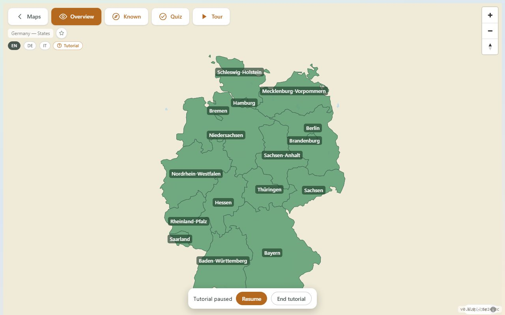

- **Resume** takes you back to where the step is and shows its card again.
- **End tutorial** ends it.

The tutorial never carries on by itself while paused. Reloading the page
or closing the app also ends it.

## 14. Languages

The whole interface is available in **English**, **German** and
**Italian**. Switch with the **EN · DE · IT** pills, on the home page or on
any map screen; the change is immediate and remembered on the device.

The home page in German:

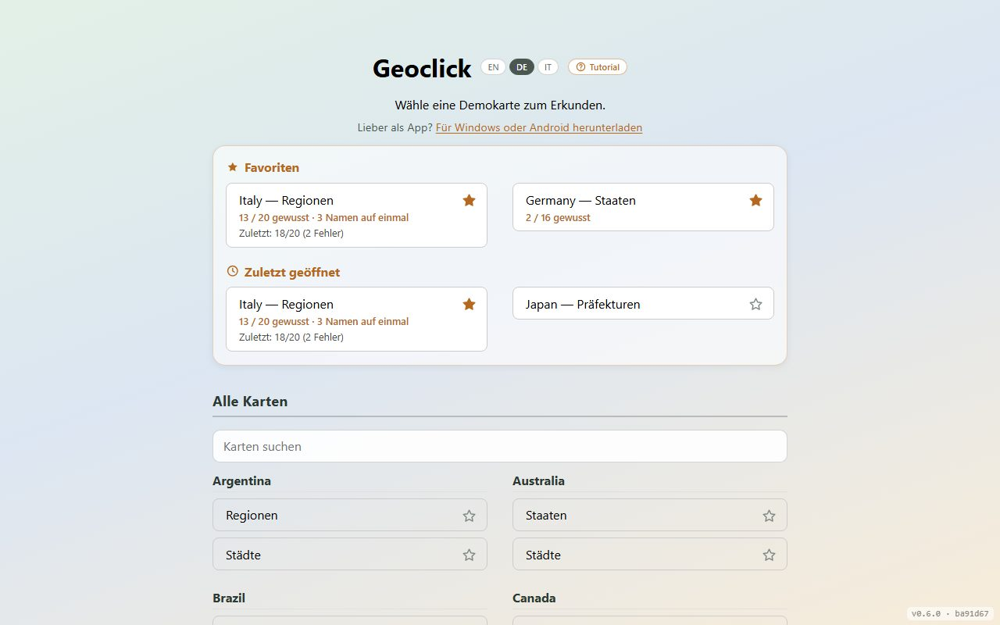

A quiz in Italian:

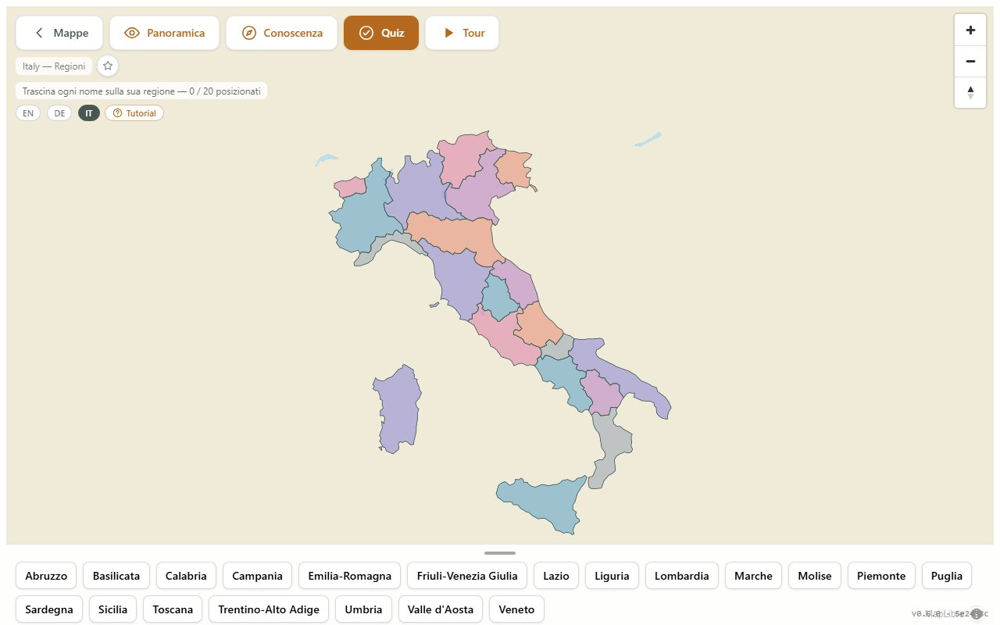

What changes and what doesn't:

- **Translated:** every button, heading, message, the tutorial, and the
  kind of map ("Regions" / "Regionen" / "Regioni", "Towns" / "Städte" /
  "Città").
- **Not translated:** place names. Regions and towns keep their names in
  the country's own language (Toscana, Bayern, Île-de-France), which is how
  they appear on local maps. Country names stay in English everywhere,
  which is why a German screen says "Italy — Regionen".

## 15. On a phone

The phone version has the same screens and features, arranged for a
narrow screen. On the home page, all cards are in a single column:

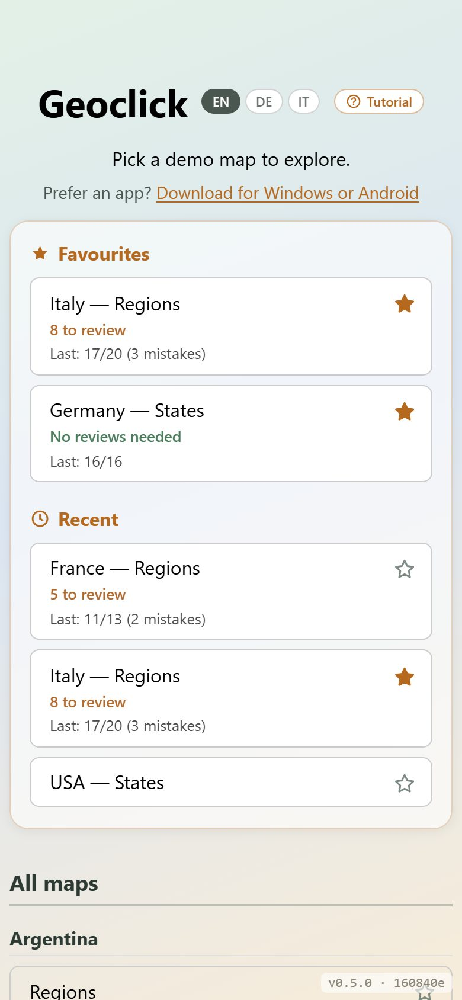

On map screens, the five buttons of the map bar are stacked icon over
label and share the width of the screen:

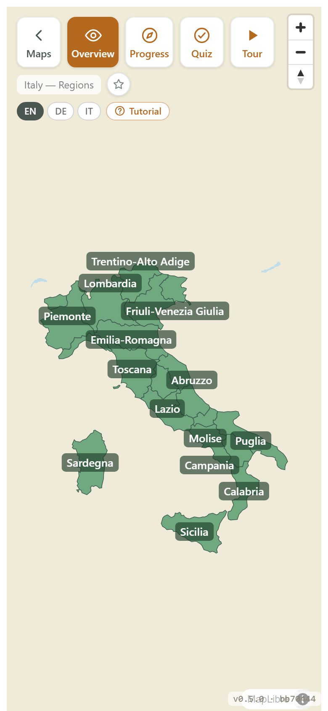

Tap a name to enlarge it; tap it again, or anywhere else, to shrink it:

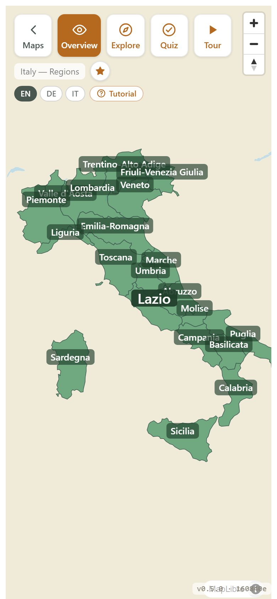

The quiz tray starts at up to about a third of the screen, and scrolls.
Here a round with 12 regions already placed:

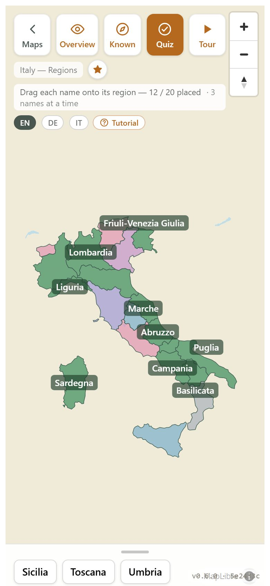

The tour's controls fill the bottom of the screen:

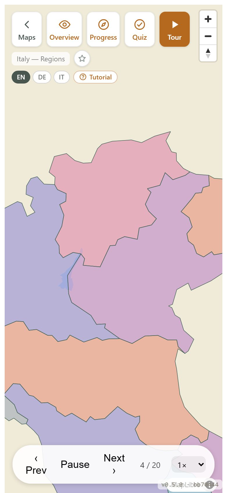

Tutorial cards span the whole width, at the top or the bottom of the
screen, whichever doesn't cover what the step is about:

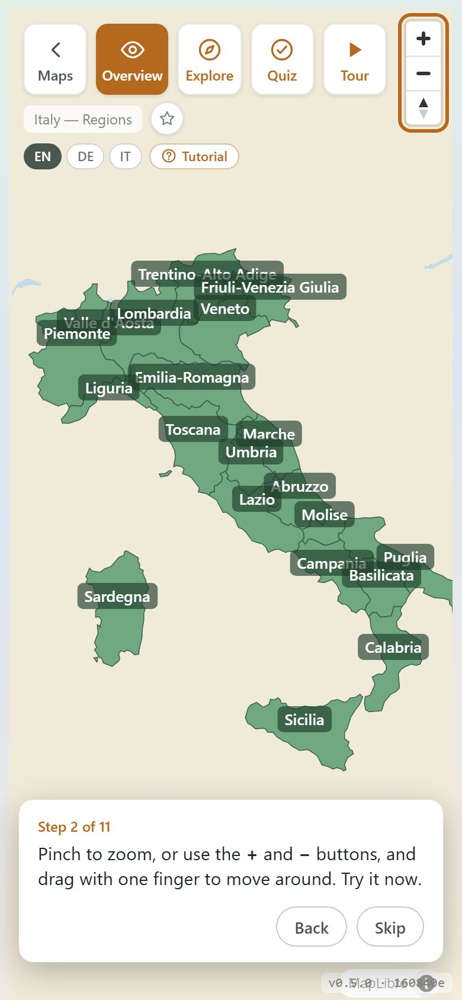

### Gestures

- **Drag with one finger** to move the map; **pinch** to zoom;
  **double-tap** to zoom in one step.
- **Drag a name** from the quiz tray with your finger.
- **Tap** a name on the map to enlarge it.

### The Android back button

In the Android app, the phone's back button goes **up one level** rather
than back through every screen you've visited:

- from a map's Quiz, Progress or Tour, back to that map's Overview;
- from an Overview, back to the list of maps;
- from the list of maps, it closes the app.

In a web browser on a phone, the browser's own back button works as in
any website.

## 16. The Windows and Android apps

The apps are the same game as the website, packaged to install:

- **Same screens and features**, including the tutorial and all three
  languages. The only difference is that the "Download for Windows or
  Android" link isn't shown inside the apps.
- **The maps are built in**, so the apps don't need the internet to play.
- **Progress is kept inside the app**, separately from any browser on the
  same device (see [Your data and privacy](#17-your-data-and-privacy)).
- **Updating:** install the new version over the old one. Progress,
  favourites and settings are kept.
- The version badge in the corner shows which version is installed.

## 17. Your data and privacy

- **No account.** There's nothing to sign up for or log in to.
- **Nothing leaves the device.** Your progress isn't sent anywhere; there
  is no Geoclick server holding it.
- **Kept on the device, per browser or app.** Geoclick remembers, on the
  device where you play:
  - how well you know each place, and each map's last result;
  - your favourites and recent maps;
  - the language you chose;
  - whether you've seen or dismissed the tutorial offer.
- **Consequences:**
  - playing on a phone and on a laptop gives two separate progress
    records; they don't sync;
  - two different browsers on the same computer also keep separate
    records, and so do the app and a browser;
  - clearing the browser's data for the site erases Geoclick's progress
    in that browser, and uninstalling the Android app erases it on the
    phone.

## 18. The maps

22 countries, 48 maps. The number in brackets is how many places the map
asks for.

| Country | Maps |
|---|---|
| Argentina | Regions (24) · Towns (30) |
| Australia | States (8) · Towns (14) |
| Brazil | States (27) · Towns (48) |
| Canada | Provinces (13) · Towns (26) |
| China | Provinces (31) · Towns (50) |
| Finland | Regions (18) · Towns (8) |
| France | Regions (13) · Towns (37) |
| Germany | States (16) · Towns (49) |
| Great Britain | Regions (15) · Towns (38) |
| India | States (36) · Towns (50) |
| Indonesia | Provinces (33) · Towns (49) |
| Italy | Provinces (110) · Regions (20) · Towns (40) |
| Japan | Prefectures (47) · Towns (66) |
| Mexico | States (32) · Towns (49) |
| Netherlands | Provinces (12) · Towns (12) |
| Poland | Regions (16) · Towns (22) |
| Portugal | Districts (18) · Towns (5) |
| Russia | Regions (83) · Towns (50) |
| Spain | Regions (16) · Towns (38) |
| Sweden | Regions (21) · Towns (5) |
| Ukraine | Regions (27) · Towns (39) |
| USA | States (49) · Cities (50) · Cities — East (82) · Cities — Center (48) · Cities — West (44) |

- Maps show the country's main territory; far-away overseas territories
  are left out.
- The United States has more big cities than one map can sensibly ask for,
  so besides **Cities** (the 50 over a million) there are three slices at
  200 000 — **East**, **Center** and **West**, split at the Mississippi and
  the Rockies. A city that two maps both cover, such as Chicago, counts on
  each of them separately.
- The map data comes from Natural Earth, a free public-domain world map.

## 19. Questions and answers

**Can I lose my progress?** Only by clearing the browser's data for the
site, or uninstalling the Android app. There's no way to lose it by
playing: the tutorial doesn't touch it, and a round you leave changes only
the names you actually placed.

**Why did my "known" count go down?** A place stops counting as known the
moment you get it wrong: its streak goes back to zero, and it takes three
clean rounds to earn it again. See
[What counts as known](#9-what-counts-as-known).

**The tray only offered me three names. Why?** Because you know most of
that map. The better you know it, the fewer names the quiz puts in front
of you, so the last few can't be worked out by elimination. See
[Fewer names as you improve](#fewer-names-as-you-improve).

**I dropped a name and nothing happened.** You let go on the sea, outside
the map, or on the tray. That doesn't count; drag it again.

**A region is too small to hit.** Zoom in first (mouse wheel, pinch or
**+**). Small regions also accept drops just next to them.

**Can I see a name while playing the quiz?** Not on the quiz screen; that's
the point. Switch to **Overview** to look it up, then back to **Quiz**. The
places you've already placed today are still placed when you come back.

**Can I play on two devices?** Yes, but each device keeps its own progress.

**How do I see the tutorial offer again?** Press **Tutorial** at any time;
the one-time offer box itself doesn't come back.

**Which version do I have?** Look at the grey badge in the bottom-right
corner of any screen, for example `v0.5.0 · 160840e`.

**Windows says the installer is from an unknown publisher.** It isn't
code-signed; choose *More info*, then *Run anyway*.

## 20. Glossary

| Term | Meaning |
|---|---|
| **Map** | One country's set of places to learn, for example Italy — Regions. |
| **Place** / **target** | One region, state, province or town on a map. |
| **Overview** | The map with its names shown — as many as fit without overlapping (a town’s name sits beside its dot); zoom in for the rest. |
| **Progress** | How well you know the map: each name drawn as strongly as you know it. Clicking a region still names it (this tab was called Explore until v0.5.0). |
| **Quiz** | The game: drag each name from the tray onto the map. |
| **Tour** | The automatic flight from place to place. |
| **Tray** | The strip of names at the bottom of the quiz. |
| **Slip** | One name in the tray. |
| **Placed** | Dropped on the right place (green). |
| **Shown** | Placed for you after a mistake (gold-brown); counts as not known. |
| **Clean streak** | How many times in a row you have placed a name right with no mistake. |
| **Known** | A place with a clean streak of three or more. |
| **Round** | One playing of a map's quiz: every name, from blank to done. |
| **Favourites** | Maps you've starred. |
| **Recent** | The last five maps you opened. |
| **Map bar** | The row of buttons at the top of every map screen. |
| **Version badge** | The small grey version number in the bottom-right corner. |
